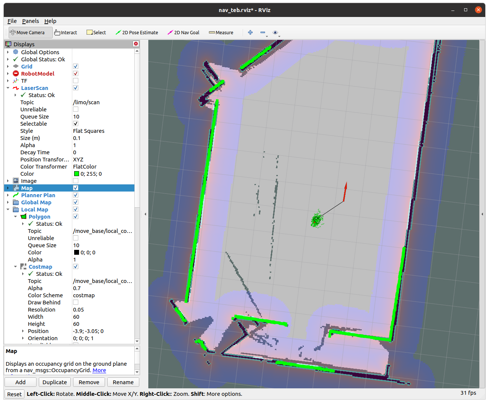

# 南方科技大学-CS405-智能机器人-实验十 Intelligent-Robots-Lab10


修改：12232434 孙耀威

## 实验任务

- 学会使用ROS的导航技术栈。

- 理解A\*/Dijkstra算法、DWA算法
- 本节lab中的车辆转向控制参数修改，使车辆能跟踪规划出来的轨迹
- 解释launch文件中不同参数的意义


## 系统环境准备

ubuntu18
```commandline
sudo apt-get install ros-melodic-navigation
sudo apt-get install ros-melodic-teb-local-planner
sudo apt-get install ros-melodic-teb-local-planner-tutorials
```

ubuntu20
```commandline
sudo apt-get install ros-noetic-navigation
sudo apt-get install ros-noetic-teb-local-planner
sudo apt-get install ros-noetic-teb-local-planner-tutorials
```
### 文件准备
将launch,param,rviz文件夹复制进上节lab的smartcar_navigation里面

## 运行规划算法


### 运行gazebo仿真
```
cd limo_ws/
source devel/setup.bash
roslaunch limo_gazebo_sim limo_four_diff.launch
```

### 规划导航（运行前更改每个launch中对应map的位置）
```
roslaunch smartcar_navigation smartcar_navigation_teb.launch
roslaunch smartcar_navigation smartcar_navigation_dwa.launch
roslaunch smartcar_navigation smartcar_navigation_teb_astar.launch
```
通过rviz工具栏中的2D Nav Goal发布重点信息

