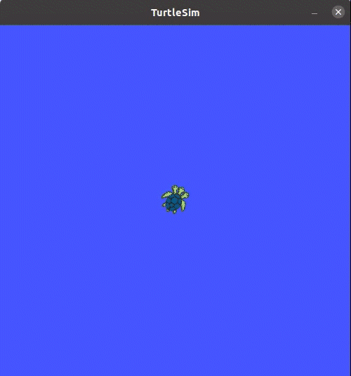
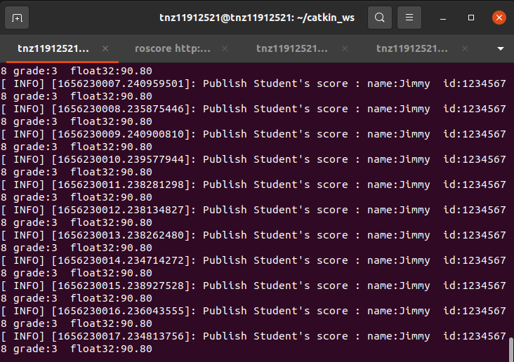
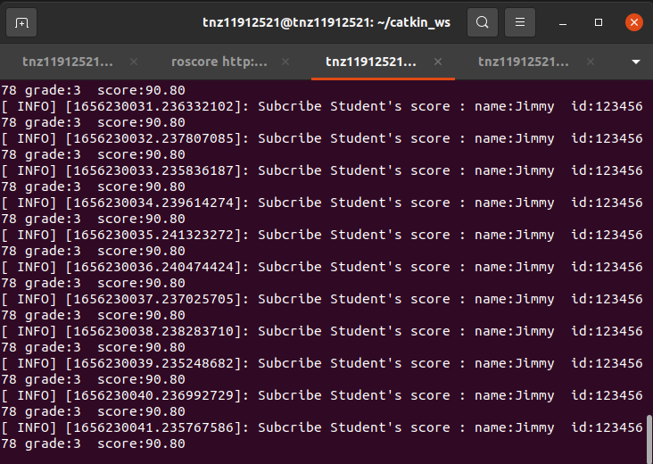
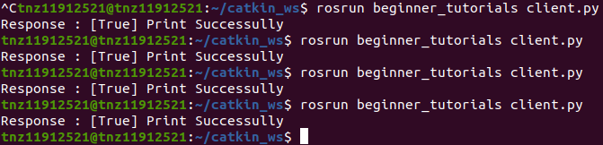
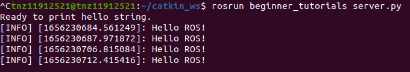
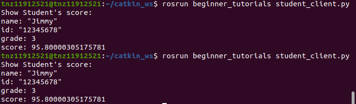
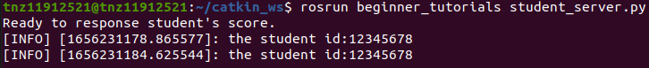
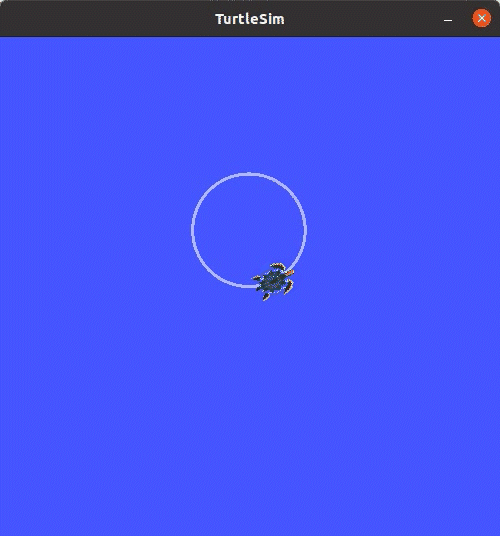

# CS401 Intelligent Robotics Lab 02

11912521 唐宁直

## 1. General Concepts of ROS

**Node:** A node is an executable that uses ROS to communicate with other nodes.
**Topic:** Nodes can publish messages to a topic as well as subscribe to a topic to receive messages.
**Message:** ROS data type used when subscribing or publishing to a topic.
**Master:** Name service for ROS (i.e. helps nodes find each other).

**rosout:** ROS equivalent of stdout/stderr.
**roscore:** Master + rosout + parameter server (parameter server will be introduced later).

**Service:** Service is another way that nodes can communicate with each other. Service allows nodes to send a request and receive a response.

## 2. Commandline Tools

**rosrun** allows you to run a node from a given package: 
`rosrun [package_name] [node_name]`

**Experiment:**

**Step 1.** Start the ROS master: `$roscore`
**Step 2.** Running turtle simulator: `$rosrun turtlesim turtlesim_node`
**Step 3.** Running control node: `$rosrun turtlesim turtle_teleop_key`



**Other Commandline Tools:**
rqt_graph; rosnode list; rosnode info; rostopic list; rostopic type; rosmsg show; rostopic pub; rostopic hz /turtle1/pose; rqt_plot; rosservice list; rosservice call; rosbag record -a -O cmd_record; rosbag play cmd_record.bag.

## 3. ROS Programming

1) Create a workspace;
2) Create packages;
3) Create source code (C++/Python);
4) Configure Compilation rules (CMakeLists.txt);
5) Compiling and running.

## 4. ROS Workspace

**src:** source space
**build:** build space
**devel:** development space
**install:** install space

**Step 1.** Create and build a catkin workspace.

```
$mkdir -p ~/catkin_ws/src
$cd ~/catkin_ws/src
$catkin_init_workspace
$cd ~/catkin_ws
$catkin_make
```

**Step 2.** Set env.

```
$source devel/setup.bash
```

**Step 3.** Check env

```
$echo $ROS_PACKAGE_PATH
```

## 5. ROS Package

1. **What are ROS Packages?**

   **Packages** are the software organization unit of ROS code. Each package can contain libraries, executables, scripts, or other artifacts.

2. **The package must contain:**

   + A catkin compliant package.xml file
   + A CMakeLists.txt which uses catkin

3. **Practice creating a ROS Package.**

   ```
   $catkin_create_pkg <package_name> [depend1] [depend2] [depend3]
   ```

   **Step 1.** Creating a catkin Package.

   ```
   $cd ~/catkin_ws/src
   $catkin_create_pkg beginner_tutorials std_msgs rospy roscpp
   ```

   **Step 2.** Building a catkin workspace.

   ```
   $cd ~/catkin_ws
   $catkin_make
   ```

   **Step 3.** Sourcing the setup file.

   ```
   $source devel/setup.bash 
   ```

4. **Practice the following ROS tools.**

   ```
   $ rospack depends1 beginner_tutorials
   $ rospack find beginner_tutorials
   $ roscd beginner_tutorials
   $ roscd log
   $ rosls beginner_tutorials
   ```

4. **Learn the structure of package.xml and CMakeLists.txt.**

***Note:***
*Under the same workspace, packages with the same name are not allowed.*
*Under different workspaces, packages with the same are allowed.*

## 6. ROS Topic

**Writing a Simple Publisher.**

1. How to write a Publisher.

   **Step 1.** Initialize the ROS system.
   **Step 2.** Register node information with the ROS Master.
   **Step 3.** Create a message.
   **Step 4.** Loop while publishing messages to Topic.

   `talker.cpp`

   ```c++
   #include "ros/ros.h"
   #include "std_srvs/SetBool.h"
   
   bool print(std_srvs::SetBool::Request &req,
   		   std_srvs::SetBool::Response &res)
   {
   
   	if (req.data)
   	{
   		ROS_INFO("Hello ROS!");
   		res.success = true;
   		res.message = "Print Successully";
   	}
   	else
   	{
   		res.success = false;
   		res.message = "Print Failed";
   	}
   
   	return true;
   }
   
   int main(int argc, char **argv)
   {
   	ros::init(argc, argv, "server");
   	ros::NodeHandle n;
   	ros::ServiceServer service = n.advertiseService("print_string", print);
   	ROS_INFO("Ready to print hello string.");
   	ros::spin();
   
   	return 0;
   }
   ```

2. Building Publisher node.

   Add two lines to the bottom of the CMakeLists.txt:

   ```
   add_executable(talker src/talker.cpp)
   target_link_libraries(talker ${catkin_LIBRARIES})
   ```

**Writing a Simple Subscriber.**

1. How to write a Subscriber.

   **Step 1.** Initialize the ROS system.
   **Step 2.** Subscribe to the Topic.
   **Step 3.** Spin, waiting for messages to arrive.
   **Step 4.** When a message arrives, the Callback function is called.

   `listener.cpp`

   ```c++
   #include "ros/ros.h"
   #include "std_msgs/String.h"
   
   /**
    * This tutorial demonstrates simple receipt of messages over the ROS system.
    */
   void chatterCallback(const std_msgs::String::ConstPtr &msg)
   {
     ROS_INFO("I heard: [%s]", msg->data.c_str());
   }
   
   int main(int argc, char **argv)
   {
     ros::init(argc, argv, "listener");
     ros::NodeHandle n;
     ros::Subscriber sub = n.subscribe("chatter", 1000, chatterCallback);
     ros::spin();
     return 0;
   }
   ```

2. Building Subscriber node.

   Add two lines to the bottom of the CMakeLists.txt:

   ```
   add_executable(listener src/listener.cpp)
   target_link_libraries(listener ${catkin_LIBRARIES})
   ```

3. Examine the simple publisher.

   **Step 1.** Start the ROS master.

   ```
   $roscore
   ```

   **Step 2. **Running the Publisher.

   ```
   $rosrun beginner_tutorials talker
   ```

   

   **Step 3.** Running the subscriber.

   ```
   $rosrun beginner_tutorials listener
   ```

   

## 7. ROS msg

1. **Define a msg file**

   The field types for msg:

   + int8, int16, int32, int64 (plus uint*)
   + float32, float64
   + string
   + time, duration
   + other msg files
   + variable-length array[] and fixed-length array[C]

   `Student.msg`

   ```yaml
   string name
   string id
   uint8 grade
   float32 score
   uint8 freshman = 1
   uint8 sophomore = 2
   uint8 junior = 3
   uint8 Senior = 4
   ```

2. **Add package dependencies in package.xml**

   ```
   <build_depend>message_generation</build_depend>
   <exec_depend>message_runtime</exec_depend>
   ```

3. **Add build options in CMakeLists.txt**

   ```
   find_package(... message_generation)
   add_message_files(FILES Student.msg)
   generate_messages(DEPENDENCIES std_msgs)
   catkin_package(... message_runtime)
   ```

4. **Building**

   ```
   $cd ~/catkin_ws
   $catkin_make
   $source devel/setup.bash
   ```

5. **Checking msg**

   ```
   rosmsg show beginner_tutorials/Student
   ```

6. **Using msg**

   `student_publisher.cpp`

   ```c++
   /**
    * This routine publish /student topic, customizing the message type: learning_topic:: student
    */
   
   #include <ros/ros.h>
   #include "beginner_tutorials/Student.h"
   
   int main(int argc, char **argv)
   {
       // ROS init
       ros::init(argc, argv, "student_publisher");
   
       // Create a node handle
       ros::NodeHandle n;
   
       //  Create a Publisher, publish a topic named /student, message type:beginner_tutorials::Student, queue length 10
       ros::Publisher person_info_pub = n.advertise<beginner_tutorials::Student>("/student_score", 10);
   
       // Set the frequency of the loop
       ros::Rate loop_rate(1);
   
       int count = 0;
       while (ros::ok())
       {
           // Initialize the message of beginner_tutorials::Student
       	beginner_tutorials::Student msg;
   		msg.name = "Jimmy";
   		msg.id = "12345678";
   		msg.grade  = beginner_tutorials::Student::junior;
   		msg.score  = 90.8;
   
           // publish message
   		person_info_pub.publish(msg);
   
          	ROS_INFO("Publish Student's score : name:%s  id:%s grade:%d  float32:%.2f",
                    msg.name.c_str(),msg.id.c_str(), msg.grade, msg.score);
           // Delay by loop frequency
           loop_rate.sleep();
       }
   
       return 0;
   }
   ```
   
   `student_subscriber.cpp`
   
   ```c++
   /**
    * This routine will subscribe to /student topic, customizing the message type learning_topic/Student
    */
    
   #include <ros/ros.h>
   #include "beginner_tutorials/Student.h"
   
   //After receiving the subscribed message,
   // enter the message callback function
   void studentCallback(const beginner_tutorials::Student::ConstPtr& msg)
   {
       // Print out the received message
       ROS_INFO("Subcribe Student's score : name:%s  id:%s grade:%d  score:%.2f",
   			 msg->name.c_str(),msg->id.c_str(), msg->grade, msg->score);
   }
   
   int main(int argc, char **argv)
   {
       // Initialize the ROS node
       ros::init(argc, argv, "student_subscriber");
   
       // Create a node handle
       ros::NodeHandle n;
   
   
       // Create a Subscriber, subscribe to the topic /student,
       // and register the callback function studentCallback
       ros::Subscriber person_info_sub = n.subscribe("/student_score", 10, studentCallback);
   
       // Enter a loop, pumping callbacks
       ros::spin();
   
       return 0;
   }
   ```

Add following lines to the bottom of the CMakeLists.txt:

```
add_executable(student_subscriber src/student_subscriber.cpp)
add_dependencies(student_subscriber beginner_tutorials_generate_messages_cpp)
target_link_libraries(student_subscriber ${catkin_LIBRARIES})
add_executable(student_publisher src/student_publisher.cpp)
target_link_libraries(student_publisher ${catkin_LIBRARIES})
add_dependencies(student_publisher beginner_tutorials_generate_messages_cpp)
```

**Step 1.** Start the ROS master

```
$roscore
```

**Step 2.** Running the Publisher

```
$rosrun beginner_tutorials student_publisher
```

**Step 3.** Running the Subscriber

```
$rosrun beginner_tutorials student_subscriber
```





## 8. ROS Service

**Writing a Server**

1. **Writing a Server Node**

   **Step 1.** Initialize the ROS system
   **Step 2.** Create a Service
   **Step 3.** Spin, waiting for request to arrive
   **Step 4.** When a request arrives, the handle function is called

2. **Building server node**

   `server.py`
   
   ```python
   #!/usr/bin/python3.8
   # -*- coding: utf-8 -*-
   # 该例程将提供print_string服务，std_srvs::SetBool
   
   import rospy
   from std_srvs.srv import SetBool, SetBoolResponse
   
   def stringCallback(req):
       if req.data:
           rospy.loginfo("Hello ROS!")
           return SetBoolResponse(True, "Print Successully")
       else:
           return SetBoolResponse(False, "Print Failed")
   
   def string_server():
       rospy.init_node('string_server')
       s = rospy.Service('print_string', SetBool, stringCallback)
       print("Ready to print hello string.")
       rospy.spin()
   
   if __name__ == "__main__":
       string_server()
   ```
   
   ```
   $rossrv show std_srvs/SetBool
   $chmod +x server.py
   ```

**Writing a Simple Client**

1. **Writing a Client Node**

   **Step 1.** Initialize the ROS system
   **Step 2.** Creates a client
   **Step 3.** Request service data
   **Step 4.** wait for response

2. **Building node**

   `client.py`
   
   ```python
   #!/usr/bin/python3.8
   # -*- coding: utf-8 -*-
   
   import sys
   import rospy
   from std_srvs.srv import SetBool, SetBoolRequest
   
   def string_client():
   	
       rospy.init_node('string_client')	
       rospy.wait_for_service('print_string')
       try:
           string_client = rospy.ServiceProxy('print_string', SetBool)
   		
           response = string_client(True)
           return response.success, response.message
       except rospy.ServiceException as e:
           print("Service call failed: %s"%e)
   
   if __name__ == "__main__":
       print("Response : [%s] %s" %(string_client()))
   ```
   
   ```
   $chmod +x client.py
   ```

**Step 1.** Start the ROS master

```
$roscore
```

**Step 2.** Running server

```
$rosrun beginner_tutorials server.py
```

**Step 3.** Running client

```
$rosrun beginner_tutorials client.py
```





## 9. ROS srv

1. **Define a srv file**

   `StuScore.srv`

   ```yaml
   string id
   string name
   string id
   uint8 grade
   float32 score
   uint8 freshman = 1
   uint8 sophomore = 2
   uint8 junior = 3
   uint8 Senior = 4
   ```

2. **Add package dependencies in package.xml**

   ```
   <build_depend>message_generation</build_depend>
   <exec_depend>message_runtime</exec_depend>
   ```

3. **Add build options in cmakelists.txt**

   find_package(... message_generation)
   add_service_files(FILES StuScore.srv)
   generate_messages(DEPENDENCIES std_msgs)
   catkin_package(... message_runtime)

4. **Building srv**

   ```
   $cd ~/catkin_ws
   $catkin_make
   $source devel/setup.bash
   ```

5. **Checking srv**

   ```
   $rossrv show beginner_tutorials/StuScore
   ```

6. **Using srv**

   `student_server.py`

   ```python
   import rospy
   # from  beginner_tutorials.srv import StuScore, StuScoreResponse
   from  beginner_tutorials.srv import *
   def studentCallback(req):
       # Display request data
       rospy.loginfo("the student id:%s ", req.id)
   
   
       # Feedback data
       return StuScoreResponse("Jimmy", "12345678",StuScoreResponse.junior,95.8)
   
   def student_server():
       # Initialize the ROS nodes
       rospy.init_node('student_server')
   
       # Create a server named /show_student and
       # register the callback function studentCallback
       s = rospy.Service('/student_score', StuScore, studentCallback)
   
       # Enter the event loop and
       # wait for the callback function studentCallback
       print("Ready to response student's score.")
       rospy.spin()
   
   if __name__ == "__main__":
       student_server()
   ```

   `student_client.py`

   ```python
   import sys
   import rospy
   from  beginner_tutorials.srv import *
   def student_client():
       # Initialize the ROS nodes
       rospy.init_node('student_client')
   
       # Wait for the /student_score service to start
       rospy.wait_for_service('/student_score')
       try:
           # Create a service client, and connect to the service named /student_score
           student_client = rospy.ServiceProxy('/student_score', StuScore)
   
           # Request service , input request data
           response = student_client("12345678")
           return response
       except rospy.ServiceException as e:
           print("Service call failed: %s"%e)
   
   if __name__ == "__main__":
       #The service is invoked and the result is displayed
       print("Show Student's score:\n%s" %(student_client()))
   ```

**Building node**

**Running**

```
$roscore
$rosrun beginner_tutorials student_server.py
$rosrun beginner_tutorials student_client.py
```





## 10. Parameter Server

The parameter server is basically a dictionary containing global variables which are accessible from anywhere in the current ROS environment. Those global variables are called ROS parameters.

A ROS parameter has a name, and a data type. Among the most common types, you can use:

- Boolean
- Integer number
- Double number
- String
- List of previous data types

**YAML parameter file**

**rosparam command-line tool**

- rosparam list
- rosparam get param_name
- rosparam set param_name param_value
- rosparam dump file_name.yaml
- rosparam load file_name.yaml
- rosparam delete param_name

**Programming for ROS parameters**

1. **Prerequisites**

   ```
   $cd ~/catkin_ws/src
   $catkin_create_pkg learning_parameter rospy roscpp std_msgs geometry_msgs turtlesim
   ```

2. **Writing a parameter config node**

   ```python
   #!/usr/bin/python3.8
   # -*- coding: utf-8 -*-
   # This routine sets/reads the parameters in the turtle routine
   
   import sys
   import rospy
   from std_srvs.srv import Empty
   
   
   def parameter_config():
       # ROS node initialization
       rospy.init_node('parameter_config', anonymous=True)
   
       # Read the background color parameter
       red = rospy.get_param('/turtlesim/background_r')
       green = rospy.get_param('/turtlesim/background_g')
       blue = rospy.get_param('/turtlesim/background_b')
   
       rospy.loginfo("Get Backgroud Color[%d, %d, %d]", red, green, blue)
   
       # Set background color parameters
       rospy.set_param("/turtlesim/background_r", 255);
       rospy.set_param("/turtlesim/background_g", 255);
       rospy.set_param("/turtlesim/background_b", 255);
   
       rospy.loginfo("Set Backgroud Color[255, 255, 255]");
   
       # Read the background color parameter
       red = rospy.get_param('/turtlesim/background_r')
       green = rospy.get_param('/turtlesim/background_g')
       blue = rospy.get_param('/turtlesim/background_b')
   
       rospy.loginfo("Get Backgroud Color[%d, %d, %d]", red, green, blue)
   
       # Call the service and refresh the background color
       rospy.wait_for_service('/clear')
       try:
           clear_background = rospy.ServiceProxy('/clear', Empty)
   
           # Request service
           response = clear_background()
           return response
       except rospy.ServiceException as e:
           print("Service call failed: %s" % e)
   
   
   if __name__ == "__main__":
       parameter_config()
   ```

2. **Building and Running**

   ```
   $cd ~/catkin_ws
   $catkin_make
   $source devel/setup.bash
   $roscore
   $rosrun turtlesim turtlesim_node
   $rosrun learning_parameter parameter_config.py
   ```

   

   

## 11. Roslaunch

roslauch is a tool for launching multiple nodes (as well as setting parameters), including Master if not running. 
roslaunch starts nodes as defined in a launch file. 
The launch file USES an XML file to configure and launch multiple nodes

**roslaunch command-line tool**

```
$roslaunch [package] [filename.launch]
```

**The syntax of the launch file**

launch, node, param, rosparam, remap, include, arg, group.

**Demo 1**

**Step 1.** Prerequisites

```
$cd ~/catkin_ws/src
$catkin_create_pkg learning_launch rospy roscpp std_msgs
```

**Step 2.** Writing publisher

`velocity_publisher.py`

```python
#!/usr/bin/python3.8
# -*- coding: utf-8 -*-
# This routine will publish the turtle1/cmd_vel topic, message type is geometry_msgs::Twist

import rospy
from geometry_msgs.msg import Twist


def velocity_publisher():
    # ROS init
    rospy.init_node('velocity_publisher', anonymous=True)

    # Create a Publisher, publish a topic named /turtle1/cmd_vel, message type: geometry_msgs:Twist, queue length 10
    turtle_vel_pub = rospy.Publisher('/turtle1/cmd_vel', Twist, queue_size=10)
    publish_frequency = rospy.get_param('~publish_frequency')
    # Set the frequency of the loop
    rate = rospy.Rate(publish_frequency)

    while not rospy.is_shutdown():
        # Initialize the message of  geometry_msgs::Twist
        vel_msg = Twist()
        vel_msg.linear.x = rospy.get_param('~linear_x')
        vel_msg.angular.z = rospy.get_param('~group/angular_z')

        # pulish message
        turtle_vel_pub.publish(vel_msg)
        rospy.loginfo("Publsh turtle velocity command[%0.2f m/s, %0.2f rad/s]",
                      vel_msg.linear.x, vel_msg.angular.z)

        # Delay by cycle frequency
        rate.sleep()


if __name__ == '__main__':
    try:
        velocity_publisher()
    except rospy.ROSInterruptException:
        pass
```

**Step 3.** Writing subscriber

`pose_subscriber.py`

```python
#!/usr/bin/python3.8
# -*- coding: utf-8 -*-
# The routine will subscribe to/turtle1/pose topic, message type is sturtlesim::Pose

import rospy
from turtlesim.msg import Pose


def poseCallback(msg):
    rospy.loginfo("Turtle pose: x:%0.6f, y:%0.6f", msg.x, msg.y)


def pose_subscriber():
    # ROS init
    rospy.init_node('pose_subscriber', anonymous=True)

    # Create a Subscriber, subscribe to the topic /turtle1/pose, and register the callback function poseCallback
    rospy.Subscriber("/turtle1/pose", Pose, poseCallback)

    # Enter a loop, pumping callbacks
    rospy.spin()


if __name__ == '__main__':
    pose_subscriber()
```

**Step 4.** Writing `turtlesim_parameter_config.launch` & `param.yaml`

`turtlesim_parameter_config.launch`

```xml
<launch>
    <param name="/number" value="3" />
    <node pkg="learning_launch" type="velocity_publisher.py" name="publisher" output="screen">
        <param name="publish_frequency" type="double" value="10.0" />
        <rosparam file="$(find learning_launch)/config/param.yaml" command="load" />
    </node>
    <node pkg="learning_launch" type="pose_subscriber.py" name="subscriber" output="screen" />
    <node pkg="turtlesim" type="turtlesim_node" name="turtle1" output="screen" />
</launch>
```

`param.yaml`

```linear_x: 1.5
linear_x: 1.5
group:
  angular_z: 1.2
```

**Step 5.** Building

```
$cd ~/catkin_ws
$catkin_make
$source devel/setup.bash
```

**Step 6.** Run launch file using roslaunch

```
$roslaunch learning_launch turtlesim_parameter_config.launch
$ros_graph
```



**Demo 2**

**Step 1.** `turtlesim_remap_include.launch`

 `turtlesim_remap_include.launch`

```xml
<launch>
    <include file="$(find learning_launch)/launch/turtlesim_parameter_config.launch" />
    <node pkg="turtlesim" type="turtlesim_node" name="turtle2" output="screen">
        <remap from="turtle1" to="turtle2" />
    </node>
    <node pkg="turtlesim" type="turtle_teleop_key" name="turtle_teleop_key" output="screen">
        <remap from="/turtle1/cmd_vel" to="/turtle2/cmd_vel" />
    </node>
</launch>
```

**Step 2.** Run launch file using roslaunch

```
$roslaunch learning_launch turtlesim_remap_include.launch
```

**Step 3.** Result


