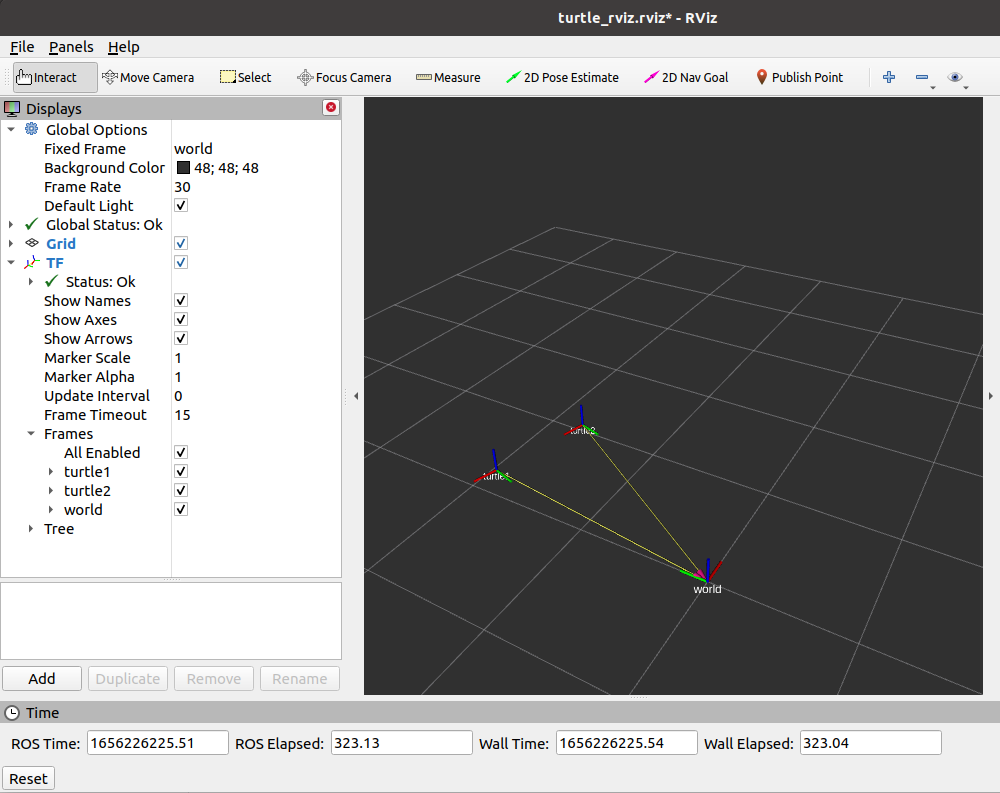

# CS401 Intelligent Robotics Lab 03

11911138 徐格蕾

## 1. tf

**Coordinate transformation**

$$
\boldsymbol{a}^{\prime}=\boldsymbol{R a}+\boldsymbol{t}
$$

**Homogeneous**

$$\begin{aligned}&{\left[\begin{array}{l}
\boldsymbol{a}^{\prime} \\
1
\end{array}\right]=\left[\begin{array}{ll}
\boldsymbol{R} & \boldsymbol{t} \\
\mathbf{0}^{T} & 1
\end{array}\right]\left[\begin{array}{l}
\boldsymbol{a} \\
1
\end{array}\right] \triangleq \boldsymbol{T}\left[\begin{array}{l}
\boldsymbol{a} \\
1
\end{array}\right]} \\
&\tilde{\boldsymbol{b}}=\boldsymbol{T}_{1} \tilde{\boldsymbol{a}}, \tilde{\boldsymbol{c}}=\boldsymbol{T}_{2} \tilde{\boldsymbol{b}} \quad \Rightarrow \tilde{\boldsymbol{c}}=\boldsymbol{T}_{2} \boldsymbol{T}_{\mathbf{1}} \tilde{\boldsymbol{a}}
\end{aligned}$$

1. **What is tf?**

   tf is a package that lets the user keep track of multiple coordinate frames over time.

2. **What does tf do?**

   tf maintains the relationship between coordinate frames in a tree structure buffered in time, 
   tf lets the user transform points, vectors, etc between any two coordinate frames at any desired point in time.

3. **How does TF work?**

   Listening for transforms & Broadcasting transforms.

4. **Special terms**

   + **Link** – each component is a link, for example: base_link, left_wheel_link, camera_link etc.
   + **Frame** – each link corresponds a frame, a frame is a coordinate.
   + **Joint** – the connection between two links.

5. **tf2**

   tf2 is the second generation of the transform library. 

   Since ROS Hydro, tf has been "deprecated" in favor of tf2.

   The tf implementation has been removed and replaced with calls to tf.

### tf introduction demo 1

*<ROS_DISTRO> need to be replaced by ROS version name (melodic or noetic)*

```bash
sudo apt-get install ros-<ROS_DISTRO>-ros-tutorials ros-<ROS_DISTRO>-geometry-tutorials ros-<ROS_DISTRO>-rviz ros-<ROS_DISTRO>-rosbash ros-<ROS_DISTRO>-rqt-tf-tree
roslaunch turtle_tf turtle_tf_demo.launch
rosrun turtlesim turtle_teleop_key
rosrun tf view_frames
rosrun rqt_tf_tree rqt_tf_tree
rosrun tf tf_echo turtle1 turtle2
rosrun rviz rviz -d `rospack find turtle_tf`/rviz/turtle_rviz.rviz
```

**view_frames** creates a diagram of the frames being broadcast by tf over ROS.

*(If there are type error, please referance this [link](https://blog.csdn.net/xiaowang_tongxue/article/details/108298544))*

**rqt_tf_tree** is a runtime tool for visualizing the tree of frames being broadcast.

**tf_echo** reports the transform between any two frames broadcast over ROS.

**rviz** is a visualization tool that is useful for examining tf frames.




### tf programming demo 2

**Step 1.** Prerequisites

```bash
cd ~/catkin_ws/src
catkin_create_pkg learning_tf tf rospy roscpp std_msgs turtlesim
```

**Step 2.** Writing a tf broadcaster and listener

`learning_tf/scripts/turtle_tf_broadcaster.py`

```python
#!/usr/bin/env python
# -*- coding: utf-8 -*-
# This routine broadcasts tf data between world and turtle coordinates
import rospy
import tf
import turtlesim.msg


def handle_turtle_pose(msg, turtlename):
    br = tf.TransformBroadcaster()
    br.sendTransform((msg.x, msg.y, 0),
                     tf.transformations.quaternion_from_euler(0, 0, msg.theta),
                     rospy.Time.now(),
                     turtlename,
                     "world")


if __name__ == '__main__':
    rospy.init_node('turtle_tf_broadcaster')
    turtlename = rospy.get_param('~turtle')
    rospy.Subscriber('/%s/pose' % turtlename,
                     turtlesim.msg.Pose,
                     handle_turtle_pose,
                     turtlename)
    rospy.spin()
```

`learning_tf/scripts/turtle_tf_listener.py`

```python
#!/usr/bin/env python
# -*- coding: utf-8 -*-
# This routine listens for tf data ， calculates and publishes speed instructions of turtle2
import rospy
import math
import tf
import geometry_msgs.msg
import turtlesim.srv

if __name__ == '__main__':
    rospy.init_node('turtle_tf_listener')

    listener = tf.TransformListener()

    rospy.wait_for_service('spawn')
    spawner = rospy.ServiceProxy('spawn', turtlesim.srv.Spawn)
    spawner(4, 2, 0, 'turtle2')

    turtle_vel = rospy.Publisher(
        'turtle2/cmd_vel', geometry_msgs.msg.Twist, queue_size=1)

    rate = rospy.Rate(10.0)
    while not rospy.is_shutdown():
        try:
            (trans, rot) = listener.lookupTransform(
                '/turtle2', '/turtle1', rospy.Time(0))
        except (tf.LookupException, tf.ConnectivityException, tf.ExtrapolationException):
            continue

        angular = 4 * math.atan2(trans[1], trans[0])
        linear = 0.5 * math.sqrt(trans[0] ** 2 + trans[1] ** 2)
        cmd = geometry_msgs.msg.Twist()
        cmd.linear.x = linear
        cmd.angular.z = angular
        turtle_vel.publish(cmd)

        rate.sleep()
```

**Step 3.** Building

```bash
cd ~/catkin_ws
catkin_make
source devel/setup.bash
```

**Step 4.** Create a launch file for this demo

`learning_tf/launch/learning_tf_py.launch`

```xml
<launch>
	<!-- Turtlesim Node-->
	<node pkg="turtlesim" type="turtlesim_node" name="sim" />
	<node pkg="turtlesim" type="turtle_teleop_key" name="teleop" output="screen" />
	<node name="turtle1_tf_broadcaster" pkg="learning_tf" type="turtle_tf_broadcaster.py" respawn="false" output="screen">
		<param name="turtle" type="string" value="turtle1" />
	</node>
	<node name="turtle2_tf_broadcaster" pkg="learning_tf" type="turtle_tf_broadcaster.py" respawn="false" output="screen">
		<param name="turtle" type="string" value="turtle2" />
	</node>
	<node pkg="learning_tf" type="turtle_tf_listener.py" name="listener" />
</launch>
```

**Step 5.** Running

```bash
roslaunch learning_tf learning_tf_py.launch
```

*NOTE: Don't forget to make the node executable:* 

```bash
roscd learning_tf
sudo chmod +x scripts/*.py
```

**Step 6.** Checking the results

Same effect as demo 1

## 2. Visualization tool

### QT Toolkit

rqt_console & rqt_plot & rqt_graph & rqt_image_view

*<ROS_DISTRO> need to be replaced by ROS version name (melodic or noetic)*

*Remenber change setting usb to usb3.1 and open camera if you use VMWare*

```bash
sudo apt-get install ros-<ROS_DISTRO>-uvc-camera
sudo apt-get install ros-<ROS_DISTRO>-image-*
sudo apt-get install ros-<ROS_DISTRO>-rqt-image-view
roscore
rosrun uvc_camera uvc_camera_node
rostopic list
rqt_image_view
```

### Rviz

Rviz is a 3d visualization environment for robots using ROS.

```
$rosrun rviz rviz
```

