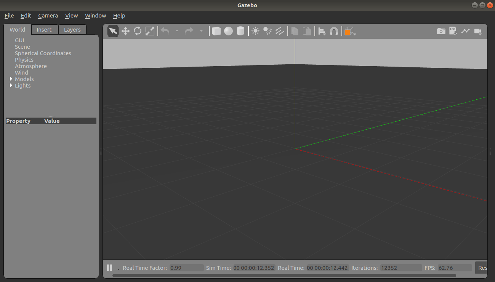
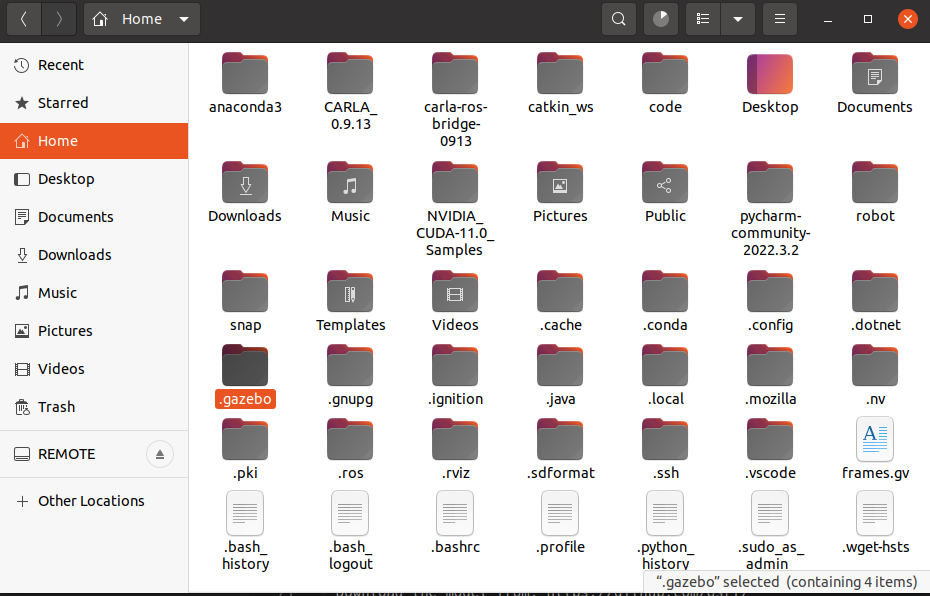
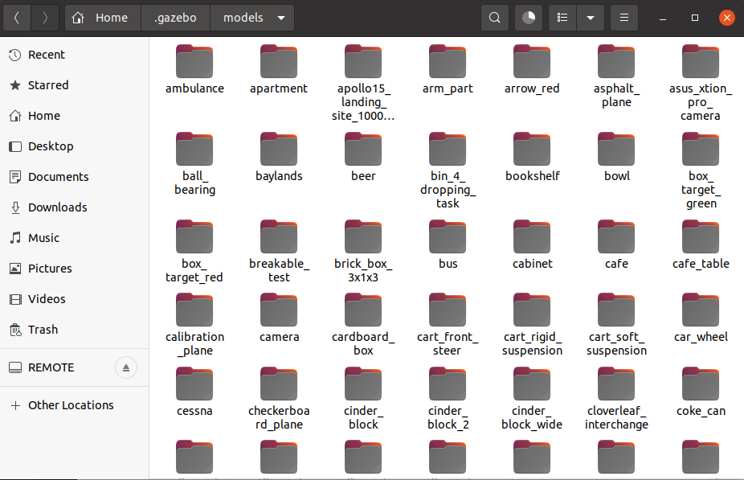
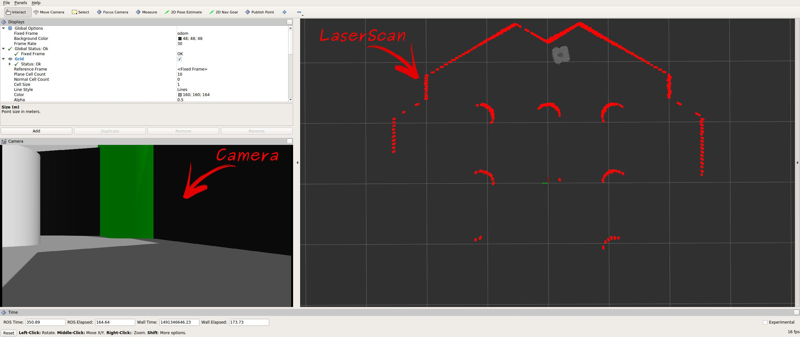
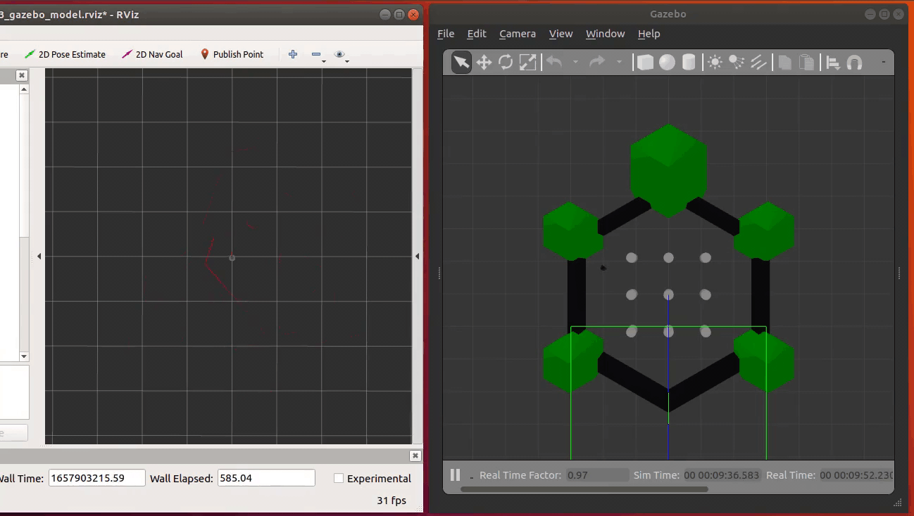
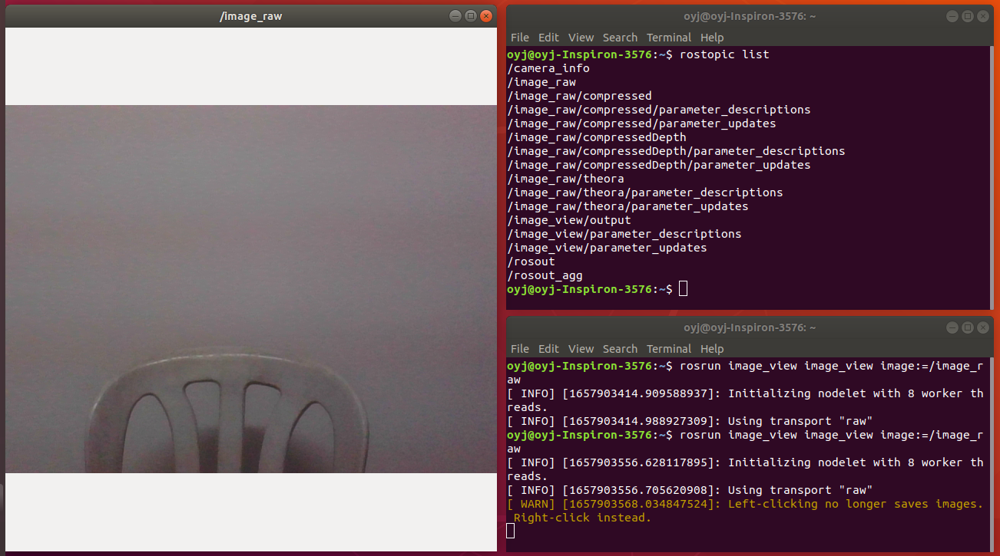
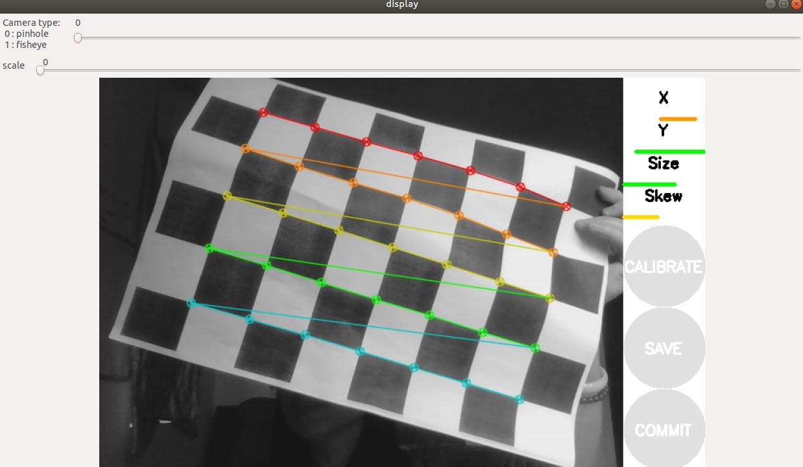
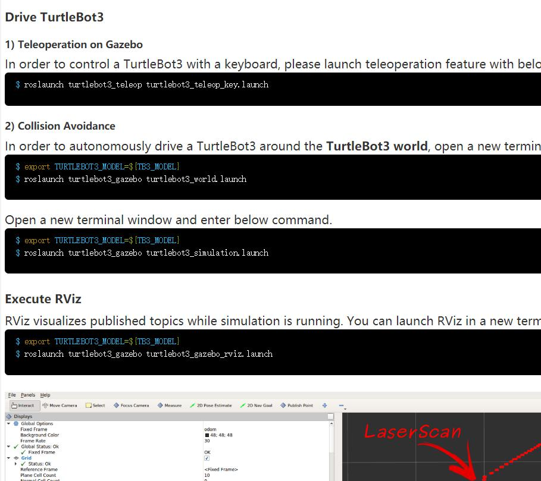
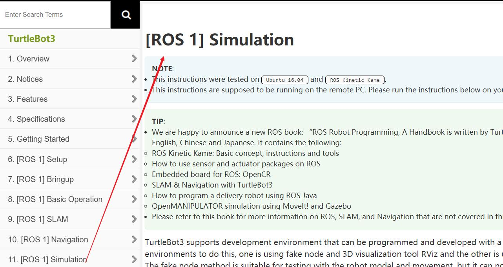
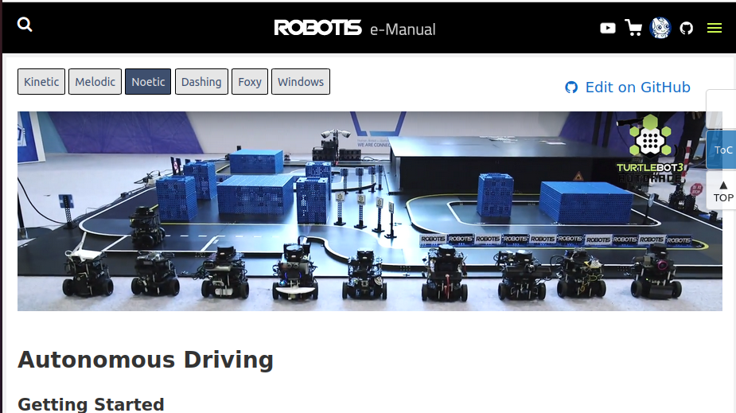

# Intelligent-Robots-Lab4

修订：12232434 孙耀威（今天也是没有犯病的一天～）


Lab4 materials for the intelligent robotics course

> **Objectives:**
>
> 1. Gazebo 
>
> 2. Turtlebot3 simulation 
>
> 3. Network Configuration 
>
> 4. Robot sensor

## 课程任务 task
1. 安装并打开gazebo
2. 使用gazebo进行简单的turtlebot3的仿真
3. 学习ros的网络配置（为后续实际远程使用turtlebot3或者其他小车准备）
4. 学会将摄像头图像传至ros并进行简单的标定
5. 在仿真/现实环境中运行turtlebot3并获取机器人的感知数据（图像，雷达等），并让车无人驾驶起来

（今天又是跟着~~麻瓜式~~教程的一天呢）

<br>

## Part 1: Gazebo

**The introduction of gazebo** 

- What is Gazebo? 
  - Gazebo is a 3D dynamic simulator with the ability to accurately and efficiently simulate populations of robots in complex indoor and outdoor environments. 

- A few key features of Gazebo include: 
  - multiple physics engines 
  - a rich library of robot models and environments, 
  - a wide variety of sensors, IMU, LIDAR, and camera... 
  - convenient programmatic and graphical interfaces 

- We can use Gazebo to: 
  - testing robotics algorithms, 
  - designing robots, 
  - performing regression testing with realistic scenarios


**Gazebo Installation**

- Integration of ROS and Gazebo

  - If you chose **desktop-full** installation when you installed ROS, Gazebo comes with it

  - Or Install gazebo packages individually by: 

    ```
    sudo apt install ros-noetic-gazebo 
    ```
- Metapackage gazebo_ros_pkgs
    - A set of packages provides wrappers around the stand-alone Gazebo. They provide the necessary interfaces to simulate a robot in Gazebo using ROS messages, services and dynamic reconfigure. 
    - Read the installation tutorial from this:http://gazebosim.org/tutorials?tut=ros_installing&cat=connect_ros


**Run Gazebo**

- There are two ways to run Gazebo, one by it alone, the other from ROS:

  ```
  gazebo
  ```

  ```
  rosrun gazebo_ros gazebo
  ```
  
  


**Download all gazebo models**

- Model files load slowly and may take a long time, so we manually download the model.

- Download the model from: https://github.com/osrf/gazebo_models （自己手动进github连接里下载模型）


- Find the **.gazebo** folder in your home path (this directory is hidden, use Ctrl+h to show the hidden directory)

  


- Create the **models** folder under this folder, and Unzip the downloaded zip file into the **models** folder

  


<br>

## Part 2: Turtlebot3 Simulation

**Introduction of TurtleBot3**

- TurtleBot3 is a small, low-cost, fully programmable, ROS-based mobile robot.
- It is intended for educational, research, product prototyping and hobby application purposes. 
- TurtleBot3 aims to drastically reduce the size and price of the platform without sacrificing performance, functionality and quality. 
- Since different options, such as chassis, computer and sensors are provided for selection. TurtleBot3 can be customized in various ways.
- TurtleBot3 adopts SBC (Single Board Computer) which is more economical and smaller than existing PC and suitable for embedded system, and it also applies the latest technologies such as distance sensor and 3D printing.


**Prerequisites**

- Install dependency package

  ```
  # ubuntu20 下载这个
  sudo apt-get install ros-noetic-joy ros-noetic-teleop-twist-joy ros-noetic-teleop-twist-keyboard ros-noetic-laser-proc ros-noetic-rgbd-launch ros-noetic-depthimage-to-laserscan ros-noetic-rosserial-arduino ros-noetic-rosserial-python ros-noetic-rosserial-server ros-noetic-rosserial-client ros-noetic-rosserial-msgs ros-noetic-amcl ros-noetic-map-server ros-noetic-move-base ros-noetic-urdf ros-noetic-xacro ros-noetic-compressed-image-transport ros-noetic-rqt-image-view ros-noetic-gmapping ros-noetic-navigation ros-noetic-interactive-markers -y
  ```

    ```
  # ubuntu18 下载这个(18的没有测试，可能有问题)
  sudo apt-get install ros-melodic-joy ros-melodic-teleop-twist-joy ros-melodic-teleop-twist-keyboard ros-melodic-laser-proc ros-melodic-rgbd-launch ros-melodic-depthimage-to-laserscan ros-melodic-rosserial-arduino ros-melodic-rosserial-python ros-melodic-rosserial-server ros-melodic-rosserial-client ros-melodic-rosserial-msgs ros-melodic-amcl ros-melodic-map-server ros-melodic-move-base ros-melodic-urdf ros-melodic-xacro ros-melodic-compressed-image-transport ros-melodic-rqt-image-view ros-melodic-gmapping ros-melodic-navigation ros-melodic-interactive-markers -y
  ```

- Install turtlebot3 and simulation (Run commands below in terminal line by line)

  ```
  mkdir -p ~/turtlebot3_ws/src/
  cd ~/turtlebot3_ws/src/
  git clone https://github.com/ROBOTIS-GIT/turtlebot3_msgs.git
  git clone https://github.com/ROBOTIS-GIT/turtlebot3.git
  git clone https://github.com/ROBOTIS-GIT/turtlebot3_simulations.git
  cd ~/turtlebot3_ws && catkin_make
  echo "source ~/turtlebot3_ws/devel/setup.bash" >> ~/.bashrc
  ```


**Launch the virtual turtlebot3 in empty world**

- Identify the model used

  ```java
  echo "export TURTLEBOT3_MODEL=burger" >> ~/.bashrc
  //TURTLEBOT3_MODEL is the name of the model you are using in burger, waffle, waffle_pi
  source ~/.bashrc
  roslaunch turtlebot3_gazebo turtlebot3_empty_world.launch
  ```

- Start a keyboard control in new terminal

  ```
  roslaunch turtlebot3_teleop turtlebot3_teleop_key.launch
  ```
  
  


**Launch the virtual turtlebot3 in TurtleBot3 World**

在开启下面教程之前，把上面跑的空世界的终端关掉
- New terminal, load gazebo

  ```java
  export TURTLEBOT3_MODEL=waffle
  //TURTLEBOT3_MODEL is the name of the model you are using in burger, waffle, waffle_pi
  roslaunch turtlebot3_gazebo turtlebot3_world.launch
  ```

- New terminal, load simulation 

  ```
  roslaunch turtlebot3_gazebo turtlebot3_simulation.launch
  ```

- New terminal, load rviz

  ```
  roslaunch turtlebot3_gazebo turtlebot3_gazebo_rviz.launch
  ```

  
  
  


**Gazebo example: TurtleBot3**

- Learn more about Gazebo in link: http://gazebosim.org/tutorials
- A Gazebo application example: http://emanual.robotis.com/docs/en/platform/turtlebot3/simulation/#
  - In this application, we show the convenience and power of Gazebo in simulation of SLAM and navigation.


<br>

## Part 3: Network Configuration

该实验用来教学如何通过ros进行多机器交互（比如两台电脑，又比如一台机器人跟一台电脑）

**Check the IP of both the host and remote PC** 

```
ifconfig 
```


**Clock synchronization**

```
sudo apt-get install chrony
sudo apt-get install ntpdate
sudo ntpdate ntp.ubuntu.com 
```


**Confirm Connectivity(Method 1)**

- Install ssh on both computers 

  ```
  sudo apt-get install openssh-server
  ```

  - On remote PC (X for graphic transmission):

    ```
    ssh [-X] username@<TURTLEBOTP_IP> 
    ```

  - Try precious command on remote PC again


**Run ROS on distributed system(Method 2)**

ROS can run on multiple machines trough network 

- Set variables in host machine

  ```
  echo "export ROS_MASTER_URI=http://localhost:11311" >> ~/.bashrc
  echo "export ROS_HOSTNAME=IP_OF_TURTLEBOT" >> ~/.bashrc 
  ```

- Set variables in remote PC

  ```
  echo "export ROS_MASTER_URI=http://IP_OF_TURTLEBOT:11311" >> ~/.bashrc 
  echo "export ROS_HOSTNAME=IP_OF_PC" >> ~/.bashrc
  ```

- You can also write in ~/.bashrc by editor directly


**Control your turtlebot**

- In turtlebot (or ssh to turtlebot): 

  ```
  roslaunch turtlebot_bringup minimal.launch
  ```

- In remote PC: 

  ```
  roslaunch turtlebot_teleop keyboard_teleop.launch
  ```


**Which method to use depends:** 

- l A robot may work in a place hard to reach, or more usually, it could not have an I/O device. 
- SSH is just use the host’s resources. 
- Distributed system can do some calculation in remote nodes (like MATLAB)


<br>

## Part 4: Robot Sensor

**Camera**

这部分教学如何通过将相机图像传至ros，详情参考lab3部分

- The camera corresponds to the eye in the robot. The images obtained from the camera are very useful for recognizing the environment around the robot

  ```
  sudo apt-get install ros-noetic-uvc-camera
  sudo apt-get install ros-noetic-image-* 
  sudo apt-get install ros-noetic-rqt-image-view 
  roscore 
  rosrun uvc_camera uvc_camera_node 
  rostopic list 
  rosrun image_view image_view image:=/image_raw
  ```

  


**Camera Calibration**

Camera calibration is necessary if you are measuring distance from images acquired with a stereo camera or processing images for object recognition.

- Prepare a Chessboard for calibration

  ```
  rosrun camera_calibration cameracalibrator.py --size 7x5 --square 0.024 image:=/image_raw camera:=/camera
  ```

  

  ```
  cd /tmp 
  tar -xvzf calibrationdata.tar.gz 
  mv ost.txt ost.ini 
  rosrun camera_calibration_parsers convert ost.ini camera.yaml 
  mkdir ~/.ros/camera_info 
  mv camera.yaml ~/.ros/camera_info/ 
  rosrun uvc_camera uvc_camera_node
  ```


**Kinect**

Kinect is an XBOX game device which contains a camera and an infrared depth camera.

- Install needed packages: 

  ```
  sudo apt-get install ros-noetic-openni-* ros-noetic-openni2-* ros-noetic-freenect-* 
  ```

- Check these packages: 

  ```
  rospack profile 
  ```

- Set the environment variable: 

  ```
  echo "export TURTLEBOT_3D_SENSOR=kinect" >> ~/.bashrc
  ```

- Test Kinect if it works well 

  - In host machine: 

    ```
    roslaunch turtlebot_bringup minimal.launch
    roslaunch freenect_launch freenect-registered-xyzrgb.launch 
    ```

  - In remote PC: 

    ```
    rosrun rqt_image_view rqt_image_view image:=/camera/rgb/image_color
    ```


**Sensor Information**

- Kinect can provide image as well as depth information
  - Lidar
  - imu
  - Odometry - Odometry is another important sensor. It provides *nav_msgs/Odometry* message by base, defaultly */odom*


<br>

## Lab Task

**Real Simulation**

- Following the instructions on website: http://emanual.robotis.com/docs/en/platform/turtlebot3/simulation/# and complete until following:

  
  
  


**Virtual Simulation**

If you couldn't use the real turtlebot in the lab room, the following tasks are done by gazebo. 

旧的教程无法使用，直接跟着官网把
1. 相机标定
2. 车道识别
3. 交通标志识别
4. 红绿灯识别
5. 综合系统运行

等部分一路跟着做完，代码都是现成的，跟着教程走完大概体会下一部自动驾驶的小车是怎么一步步实现各种功能的

https://emanual.robotis.com/docs/en/platform/turtlebot3/autonomous_driving/#getting-started

进入页面后，ubuntu20的系统点击noetic，18的系统点击melodic

  

  看到没，上面一排各种版本的教程选择

  加油！

<br>

## Lab References

**Further References**

- Gezebo 
  - http://gazebosim.org

- TurtleBot 
  - http://wiki.ros.org/Robots/TurtleBot 
- TurtleBot3 
  - http://emanual.robotis.com/docs/en/platform/turtlebot3
