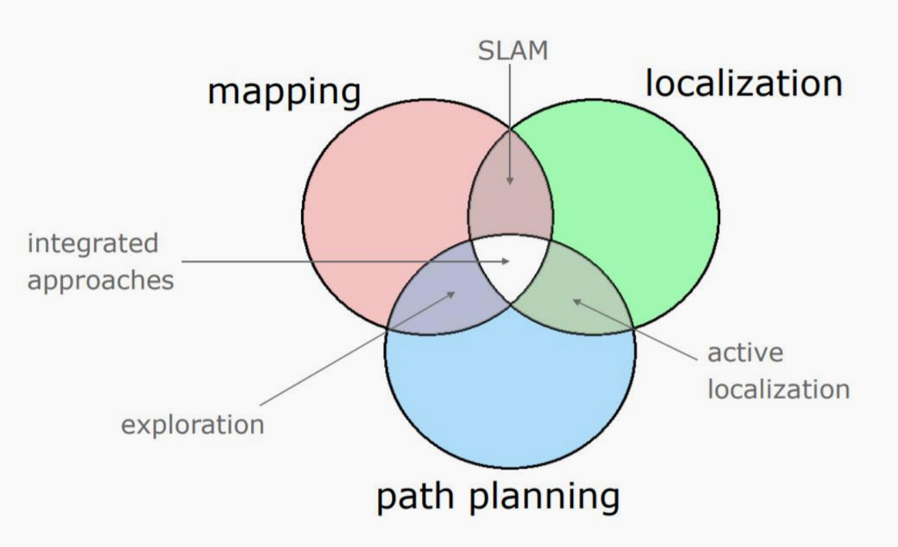

# Intelligent-Robots-Lab8

## Introduction of Mapping, Localization, Navigation



## **Build a map using gmapping**


### Configure gmapping
安装gmapping库
```commandline
    cd catkin_ws/src    
    git clone https://github.com/ros-perception/slam_gmapping.git
```
自行编译与source

然后在slam gmapping的文件夹中的launch里 存在slam_gmapping_pr2.launch文件

其中第四行是gmapping会订阅scan雷达数据，但是原来的gmapping订阅的是basescan

我们需要将其改为limo小车发布的scan雷达的topic（这部分自行研究）

```commandline
建议研究下两个命令
rostopic list
rostopic info

```
### run limo simulate
在gazebo中进行limo小车的gmapping仿真

Enter the limo_ws folder

```
cd limo_ws
```

Declare the environment variable

```
source devel/setup.bash
```

Start the simulation environment of limo, limo have two movement mode, the movement mode is Ackerman mode

开启limo的gazebo环境仿真
1. 打开空白的世界诶
```
#这条命令会打开一个空白的世界
roslaunch limo_gazebo_sim limo_ackerman.launch
```
2. 打开含有地图的世界

```
roscd limo_gazebo_sim
cd launch
gedit limo_ackerman.launch
```
可以看到 limo_ackerman.launch 文件，其中第五行有个world_name的参数,默认参数是empty.world

可以选择的世界有两种
```
willowgarage.world
clearpath_playpen.world
```
选择其一替换掉empty.world，然后再运行
```
roslaunch limo_gazebo_sim limo_ackerman.launch
```
这里因为修改了默认模型，所以会打开新的世界而不是空白的世界

下图为使用willowgarage.world的世界中rviz的图像与gazebo的图像

 

 


3. Control by keyboard, the robot can be controlled to move forward, left, right and backward through "i", "j", "l",and "," on the keyboard

```
rosrun teleop_twist_keyboard teleop_twist_keyboard.py 
```
如果感觉转弯效果不明显，可以按e增加转弯控制的极限

比如原来按转弯前轮只转10度，按了后就变成11度，再按就变12.1度，转弯会逐渐变明显
 


### use gmapping

在上面那节自己找一个带有地图的limo仿真运行

```commandline
cd catkin_ws/src/slam_gmapping/gmapping/launch/
roslaunch ./slam_gmapping_pr2.launch 
```

自行打开rviz观察建图的状态
```commandline
rviz
```
gmapping建图的地图的topic名称是/map

rviz在查看地图时有大概这个效果

 

自行移动小车来构建更大的地图
保存地图

```commandline
rosrun map_server map_saver -f ~/map
```

