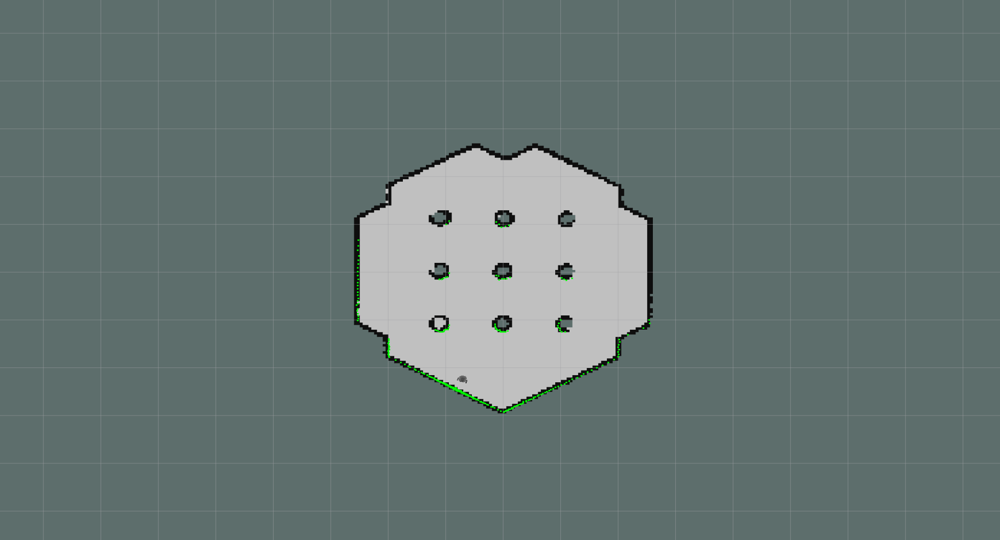
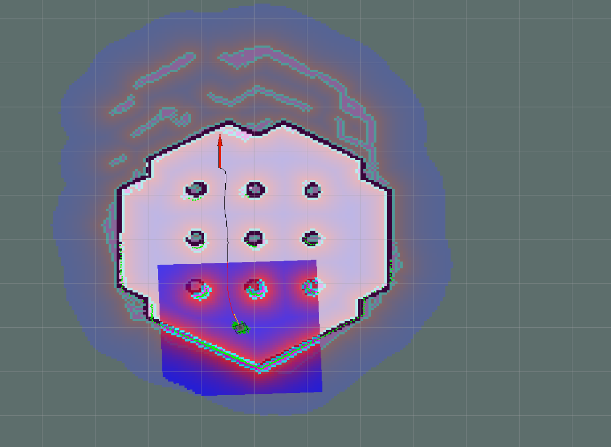
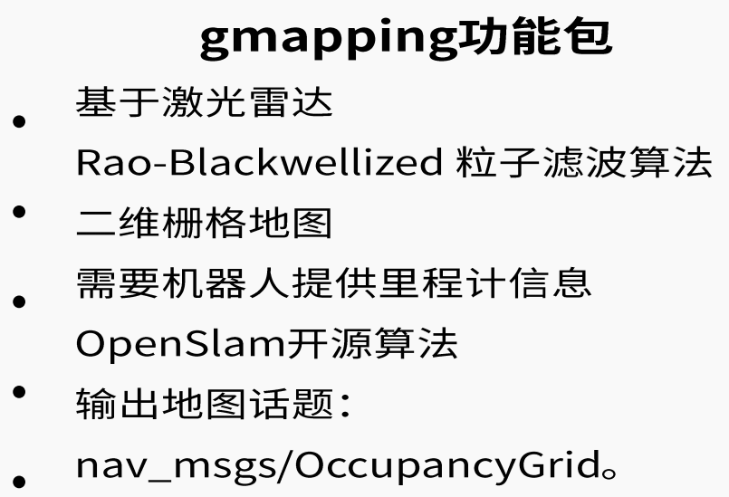
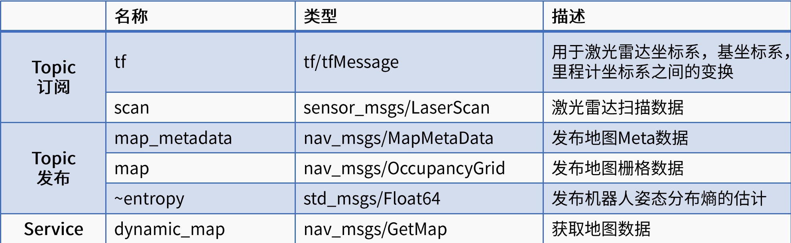
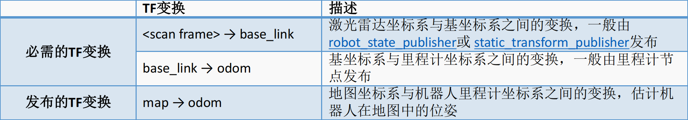
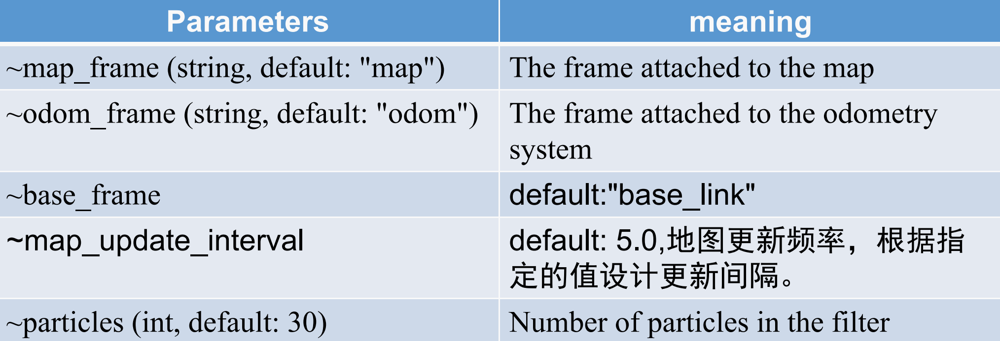
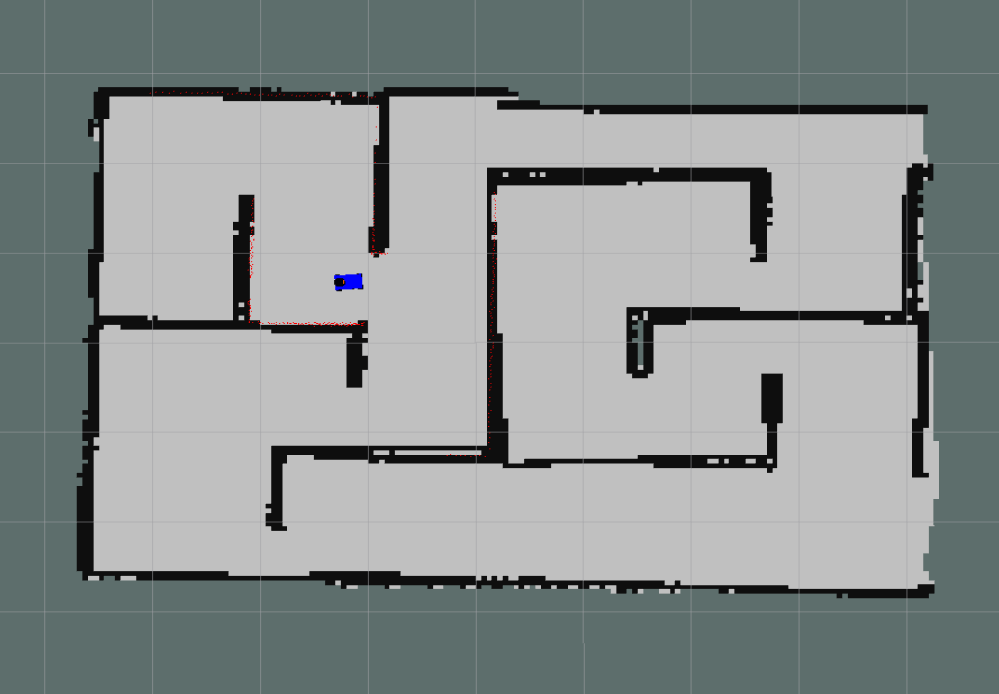

# Intelligent-Robots-Lab8

## Introduction of Mapping, Localization, Navigation


## Gmapping

### **Gmapping for turtlebot3**

- Terminal 1

  ```shell
  $export TURTLEBOT3_MODEL=burger # TURTLEBOT3_MODEL有burger, waffle或waffle_pi三种
  $roslaunch turtlebot3_gazebo turtlebot3_world.launch
  ```

- Terminal 2

  ```shell
  $export TURTLEBOT3_MODEL=burger
  $roslaunch turtlebot3_slam turtlebot3_slam.launch slam_methods:=gmapping
  ```

- Terminal 3

  ```shell
  $roslaunch turtlebot3_teleop turtlebot3_teleop_key.launch
  ```

- Terminal 4

  ```shell
  $rosrun map_server map_saver -f ~/map
  ```



### **Navigation for turtlebot3**

- Terminal 1

  ```shell
  $export TURTLEBOT3_MODEL=burger
  $roslaunch turtlebot3_gazebo turtlebot3_world.launch
  ```

- Terminal 2

  ```shell
  $export TURTLEBOT3_MODEL=burger
  $roslaunch turtlebot3_navigation turtlebot3_navigation.launch map_file:=/home/zsh/map.yaml
  ```



### **Gmapping**

- In ROS, gmapping is implemented by node slam_gmapping.

- **Gmapping** is a reliable and mature SLAM algorithm.

- 

- **Install Gmapping**

  ```shell
  $sudo apt-get install ros-melodic-gmapping
  ```

- Topics and services of gmapping:

  - 

- tf transform of gmapping:

  - 

- Some important **parameters** of gmapping:

  - 

## **Build a map using gmapping**

### Configure gmapping

- **Creating a catkin Package**

  ```shell
  $cd ~/smartcar_ws/src
  $catkin_create_pkg smartcar_slam roscpp rospy sensor_msgs
  ```

- **Write launch file**

  ```shell
  $cd smartcar_slam
  $mkdir launch 
  $cd launch 
  $touch smartcar_gmapping.launch
  ```

  ```shell
  <launch>
      <param name="use_sim_time" value="true"/>
      <node pkg="gmapping" type="slam_gmapping" name="slam_gmapping" output="screen">
          <remap from="scan" to="scan"/>
          <param name="base_frame" value="base_footprint"/><!--底盘坐标系-->
          <param name="odom_frame" value="odom"/><!--里程计坐标系-->
          <param name="map_update_interval" value="5.0"/>
          <param name="maxUrange" value="16.0"/>
          <param name="sigma" value="0.05"/>
          <param name="kernelSize" value="1"/>
          <param name="lstep" value="0.05"/>
          <param name="astep" value="0.05"/>
          <param name="iterations" value="5"/>
          <param name="lsigma" value="0.075"/>
          <param name="ogain" value="3.0"/>
          <param name="Lskip" value="0"/>
          <param name="srr" value="0.1"/>
          <param name="srt" value="0.2"/>
          <param name="str" value="0.1"/>
          <param name="stt" value="0.2"/>
          <param name="linearUpdate" value="1.0"/>
          <param name="angularUpdate" value="0.5"/>
          <param name="temporalUpdate" value="3.0"/>
          <param name="resampleThreshold" value="0.5"/>
          <param name="particles" value="30"/>
          <param name="xmin" value="-50.0"/>
          <param name="ymin" value="-50.0"/>
          <param name="xmax" value="50.0"/>
          <param name="ymax" value="50.0"/>
          <param name="delta" value="0.05"/>
          <param name="llsamplerange" value="0.01"/>
          <param name="llsamplestep" value="0.01"/>
          <param name="lasamplerange" value="0.005"/>
          <param name="lasamplestep" value="0.005"/>
      </node>
  </launch>
  ```

### Steps to run gmapping

- **Bring up the smartcar**

  ```shell
  $roslaunch smartcar_gazebo smartcar_with_laser_nav.launch
  ```

- **Run the gmapping launch file**

  ```shell
  $roslaunch smartcar_slam smartcar_gmapping.launch
  ```

- **Start the keyboard control**

  ```shell
  $rosrun smartcar_telep smartcar_teleop_key.py
  ```

- **Start rviz tool to see the mapping progress**

  ```shell
  $rviz
  # Please select messages of topics: /odom /LaserScan /map 
  # Fixed Frame should be map
  ```

  

## **Map server**

### **Introduction of map server**

- We have built the map by GMapping and displayed the map in RVIz, but currently the map data is kept in memory and is released when the node is shut down.
- We need to serialize the raster map to the disk for persistent storage, and then read the map data from the disk through deserialization before proceeding with subsequent operations.
- In ROS, serialization and deserialization of map data can be achieved through the MAP_Server function package.
- **“map_server”** **package in the** **navigation** **metapackage.**
- Map_server provides two nodes:map_saver and map_server.
- map_saver is used to save a map to disk.
- map_server reads a map from disk.

### **Save the map** 

```shell
$cd ~/smartcar_slam
$cd launch 
$touch smartcar_savemap.launch
```

```shell
<launch>
    <arg name="filename" value="$(find smartcar_slam)/map/maze_gmapping" />
    <node name="map_save" pkg="map_server" type="map_saver" args="-f $(arg filename)" />
</launch>
```

```shell
$roslaunch smartcar_slam smartcar_savemap.launch
```

### **Load the map**

```shell
$cd ~/smartcar_slam
$cd launch 
$touch smartcar_loadmap.launch
```

```shell
<launch>
    <!--设置地图的配置文件-->
    <arg name="map" value="$(find smartcar_slam)/map/maze_gmapping.yaml" />
    <!--运行地图服务器，并且加载设置的地图-->
    <node name="map_server" pkg="map_server" type="map_server" args="$(arg map)"/>
</launch>
```

```shell
$roslaunch smartcar_slam smartcar_loadmap.launch
```

