# IR_LAB 9 Tutorial

## Comparison of three SLAM(gmapping、hector、cartographer) algorithms
修改：12232434 孙耀威


### Gmapping

#### 1、Introduction

1) 基于激光雷达
2) Rao-Blackwellized粒子滤波算法
3) 二维栅格网络
4) 需要机器人提供里程计信息
5) OpenSlam开源算法
6) 输出地图话题：nav_msgs/OccupancyGrid


论文可参考：http://openslam.org/gmapping/html

#### use gmapping


自行选择一个带有场景的地图打开limo的仿真，这部分之前的lab写了就问题不大，问题大的反省下
`roslaunch limo_gazebo_sim limo_ackerman.launch`

```commandline
source catkin_ws/devel/setup.bash
roslaunch catkin_ws/src/slam_gmapping/gmapping/launch/slam_gmapping_pr2.launch 
```

gmapping建图的地图的topic名称是/map

rviz在查看地图时有大概这个效果

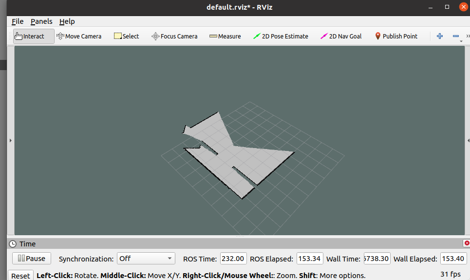 

自行移动小车来构建更大的地图
保存地图，自己修改保存位置

```commandline
rosrun map_server map_saver -f ~/map
```


### Hector_slam

#### 1、Introduction
1) 基于激光雷达
2) 高斯牛顿法
3) 二维栅格网络
4) 不需要里程计数据
5) 输出地图话题：nav_msgs/OccupancyGrid


#### 2、Topics and services of hector


#### 3、Tf transform of hector


#### 4、Install hector_slam

源码安装 installation
`For source installation, https://github.com/tu-darmstadt-ros-pkg/hector_slam.git`

自行通过git将该代码clone到想要放的workspace里面，然后自己编译

#### 5、Code for limo

##### 1) Configure hector

进入到hector_slam的文件夹里的hector_mapping/launch文件夹里,修改mapping_default.launch的文件参数

编辑scan_topic的参数，使用limo小车的雷达topic替代（就不直接说limo雷达topic叫什么名字，问就是自己研究上一节lab的内容）

base_frame 的参数修改为limo小车的雷达topic的frame

（参考 rostopic echo 的使用方法，醒醒，学期过半了，助教不会再把饭喂进嘴里了）

（附：frame是字符串，且不用包含/）


##### 2) Running hector_slam in Simulation

自行选择一个带有场景的地图打开limo的仿真，这部分之前的lab写了就问题不大，问题大的反省下
`roslaunch limo_gazebo_sim limo_ackerman.launch`

在hector_slam/hector_mapping/launch 下打开终端，运行建图算法
`roslaunch ./mapping_default.launch`

自行移动小车来构建更大的地图
`rosrun teleop_twist_keyboard teleop_twist_keyboard.py`


##### 3) Save map

保存地图，自己修改保存位置

```commandline
rosrun map_server map_saver -f ~/map
```

#### 7、Result

直接在limo仿真的打开的rviz里查看map的topic，详情请搜索如何使用rviz
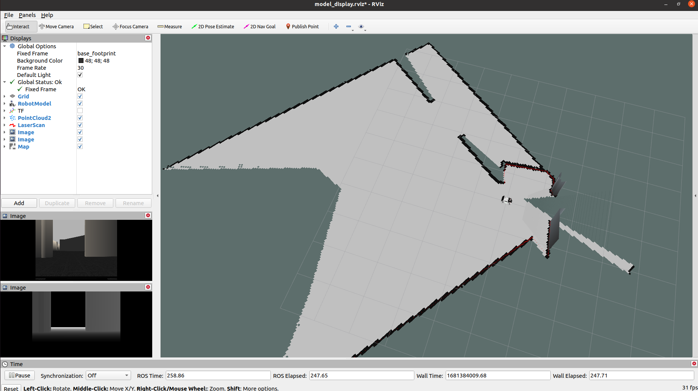

#### 8、hector_slam过程中会出现打滑显现


### Cartographer

#### 1、Introduction

1) 2016年10月5日，谷歌开源
2) 二维或三维条件下的定位及建图功能
3) 设计目的是在计算资源有限的情况下，实时获取相对较高精度的2D地图
4) cartographer采用基于图网络的优化方法
5) 目前cartographer主要基于激光雷达来实现SLAM
6) 谷歌希望通过后续的开发及社区的贡献支持更多的传感器和机器人平台，同时不断增加新的功能

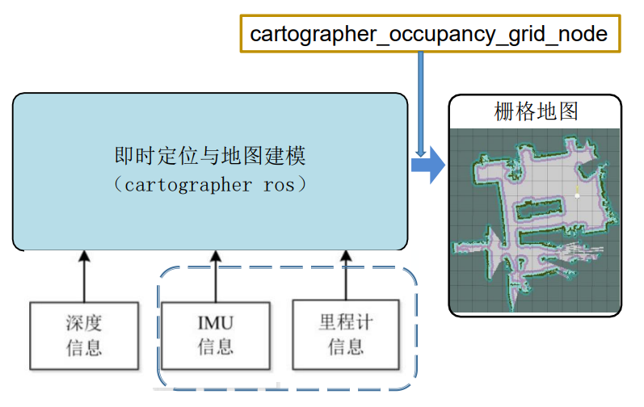

相关链接

https://github.com/googlecartographer/cartographer_turtlebot

https://google-cartographer-ros.readthedocs.io/en/latest/

http://wiki.ros.org/cartographer

（ubuntu20安装cartographer）
https://blog.yanjingang.com/?p=6346

（cartographer 运行与建图）
https://blog.csdn.net/weixin_49195458/article/details/125067284

（cartographer 保存地图）
http://events.jianshu.io/p/ef538b90a034

（pbstream转pgm和yaml格式报错原因）
https://www.cnblogs.com/havain/p/11873093.html

#### 2、Install cartographer
##### 2.1  Package installation (ubuntu18)

`sudo apt-get install ros-melodic-cartographer-*`

##### 2.2  Package installation (ubuntu20)


```commandline

# 1.安装编译工具wstool、rosdep、ninjd
sudo apt update
# on Noetic
sudo apt install -y python3-wstool python3-rosdep ninja-build stow
# other distribution
sudo apt-get install -y python-wstool python-rosdep ninja-build stow

# 2.下载cartographer_ros源码
mkdir ~/catkin_ws_carto  &&  cd ~/catkin_ws_carto
wstool init src
wstool merge -t src https://raw.githubusercontent.com/cartographer-project/cartographer_ros/master/cartographer_ros.rosinstall
wstool update -t src

# 3.安装依赖包proto3、deb等
# 注意proto3如果通过apt下过的可以不用在下（protoc --version）

sudo rosdep init   #如果执⾏报错，可以直接忽略
rosdep update
rosdep install --from-paths src --ignore-src --rosdistro=${ROS_DISTRO} -y

./src/cartographer/scripts/install_debs_cmake.sh  #req libs
./src/cartographer/scripts/install_abseil.sh    #abseil
./src/cartographer/scripts/install_proto3.sh    #proto3
./src/cartographer/scripts/install_ceres.sh     #ceres-solver 如果代码下不下来，修改.sh里git clone https://github.com/ceres-solver/ceres-solver.git

cd ~/catkin_ws_carto/src/cartographer_ros/cartographer_ros/configuration_files
cp revo_lds.lua rplidar.lua
gedit rplidar.lua

```
修改字段如下：
```txt
tracking_frame = “laser_link”,
published_frame = “laser_link”
```

然后编译安装
```commandline
# 5.编译和安装cartographer_ros整个项⽬⼯程
cd  ~/catkin_ws_carto
catkin_make_isolated --install --use-ninja
source install_isolated/setup.bash
```


#### 3、Code for limo

##### 1) Configure cartographer

Create launch file
```commandline
cd ~/catkin_ws_carto/src/cartographer_ros/cartographer_ros/launch
cp demo_revo_lds.launch cartographer_demo_rplidar.launch
gedit cartographer_demo_rplidar.launch
```
并修改为以下代码：

```xml
<launch>  
  
  <param name="/use_sim_time" value="true" />  

  <node name="cartographer_node" pkg="cartographer_ros"  
        type="cartographer_node" args="  
            -configuration_directory $(find cartographer_ros)/configuration_files  
            -configuration_basename rplidar.lua"  
        output="screen">  
    <remap from="scan" to="scan" />  
  </node>  

  <node name="rviz" pkg="rviz" type="rviz" required="true"  
        args="-d $(find cartographer_ros)/configuration_files/demo_2d.rviz" />  
</launch>
```


##### 2) Running Cartographer in Simulation


自行选择一个带有场景的地图打开limo的仿真，这部分之前的lab写了就问题不大，问题大的反省下
`roslaunch limo_gazebo_sim limo_ackerman.launch`

运行建图算法

```commandline
cd ~/catkin_ws_carto
source install_isolated/setup.bash
roslaunch cartographer_ros cartographer_demo_rplidar.launch
```
自行移动小车来构建更大的地图

`rosrun teleop_twist_keyboard teleop_twist_keyboard.py`

在rviz的建图效果是这样的

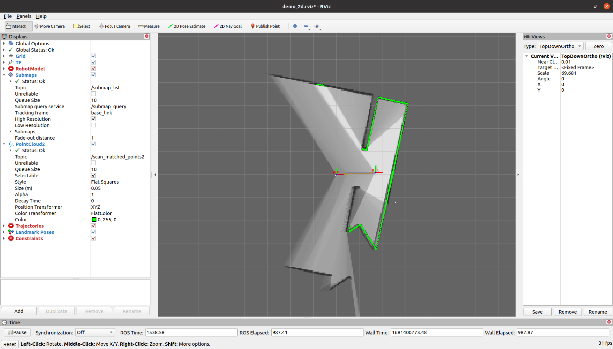


##### 3) Save map

```commandline
cd ~/catkin_ws_carto
source install_isolated/setup.bash
rosservice call /finish_trajectory 0
rosservice call /write_state "{filename: '${HOME}/Downloads/MyMap.pbstream'}"
```
这样地图就会被保存成pbstream的格式了

接下来是将地图转化为yaml和pgm格式
```commandline
rosrun cartographer_ros cartographer_pbstream_to_ros_map  -map_filestem=${HOME}/Downloads/MyMap  -pbstream_filename=${HOME}/Downloads/MyMap.pbstream -resolution=0.05
```

#### 5、Result

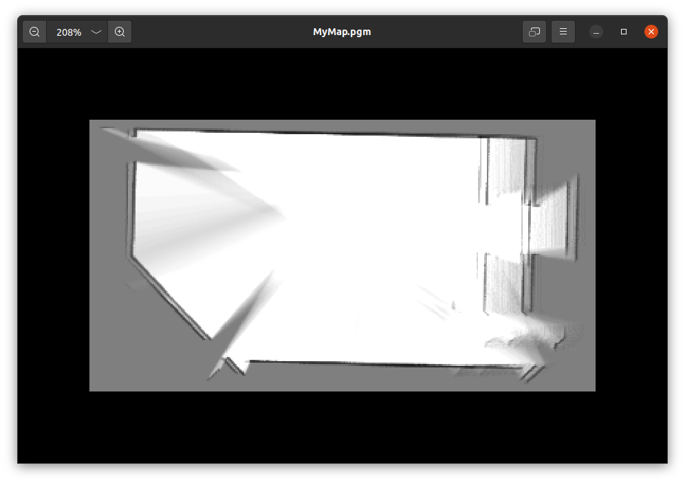

## Localization

### Introduction
智能机器人五点关键技术
1、全局地图
2、自身定位
3、路径规划
4、运动控制
5、环境感
机器人导航实现与无人驾驶类似，关键技术也是由上述五点组成，只是无人驾驶是基于室外的，而我们当前介绍的机器人导航更多是基于室内的。

所谓定位就是推算机器人自身在全局地图中的位置，当然，SLAM中也包含定位算法实现，不过SLAM的定位是用于构建全局地图的，是属于导航开始之前的阶段，而当前定位是用于导航中，导航中，机器人需要按照设定的路线运动，通过定位可以判断机器人的实际轨迹是否符合预期。在ROS的导航功能包集navigation中提供了 amcl 功能包，用于实现导航中的机器人定位。

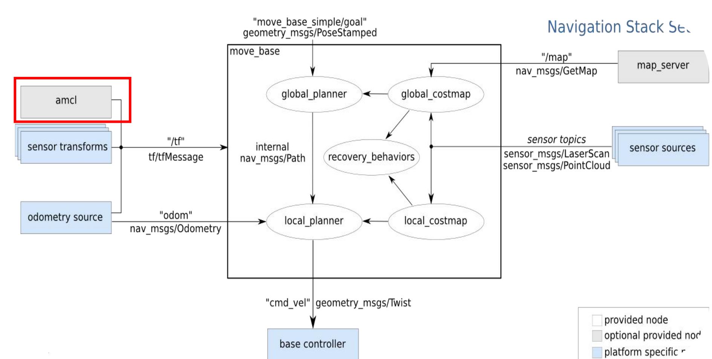

相关链接

http://wiki.ros.org/amcl

https://github.com/ros-planning/navigation.git

### MCL

#### 1、MCL
Monte-Carlo Localization is a kind of particle filter used to generate particles to approximate the real location probabilit。

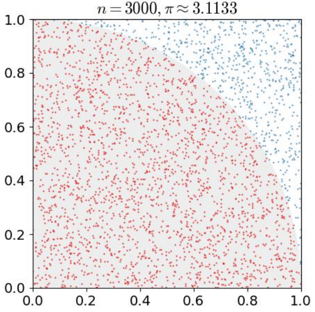

Pseudocode


问题：器人突然被抱走，放到了另外一个地方，多少粒子合适？

#### 2、AMCL

解决了机器人绑架问题，AMCL会在发现粒子们的平均分数突然降低了（意味着正确的粒子在某次迭代中被抛弃了）的时候，在全局再重新的撒一些粒子

解决了粒子数固定的问题，因为有时候当机器人定位差不多得到了的时候，比如这些粒子都集中在一块了，还要维持这么多的粒子没必要，这个时候粒子数可以少一点了

Pseudocode


#### 3、KLD MCL

为了控制上述粒子数冗余而设计的。比如在栅格地图中,看粒子占了多少栅格。占得多，说明粒子很分散，在每次迭代重采样的时候，允许粒子数量的上限高一些。占得少，说明粒子都已经集中了，那就将上限设低，采样到这个数就行了

Pseudocode


对应部分：

```html
<param name="kld_err" value="0.05"/>
<param name="kld_z" value="0.99"/>
```

#### 4、MCL Sample_motion_model


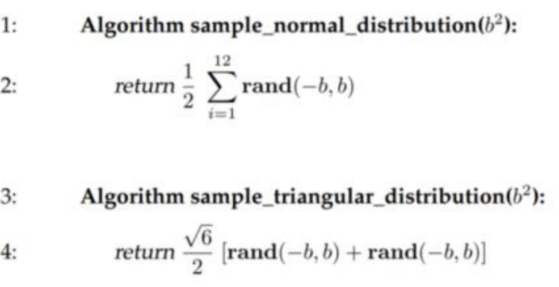

对应部分：

```html
<param name="odom_model_type" value="diff"/>
<param name="odom_alpha5" value="0.1"/>
<param name="odom_alpha1" value="0.2"/>
<param name="odom_alpha2" value="0.2"/>
<param name="odom_alpha3" value="0.8"/>
<param name="odom_alpha4" value="0.2"/>
```

#### 5、MCL measurement_model


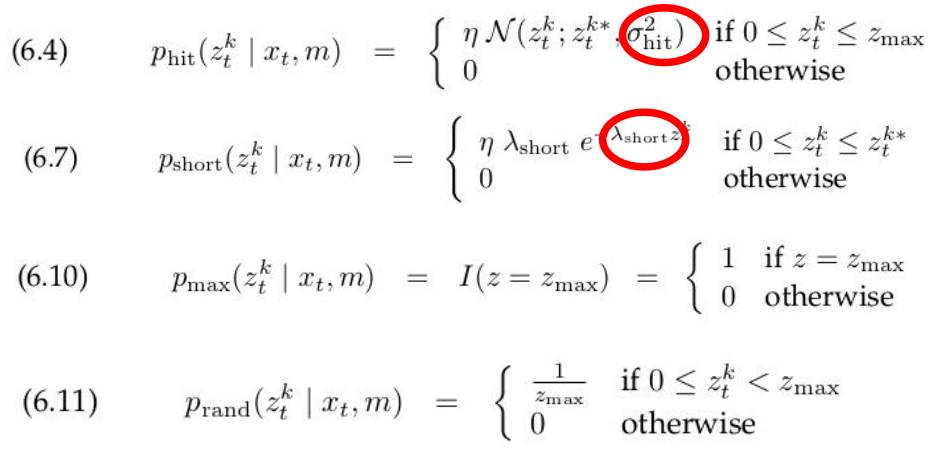

对应部分：

```html
<param name="laser_z_hit" value="0.5"/>
<param name="laser_z_short" value="0.05"/>
<param name="laser_z_max" value="0.05"/>
<param name="laser_z_rand" value="0.5"/>
<param name="laser_sigma_hit" value="0.2"/>
<param name="laser_lambda_short" value="0.1"/>
```


对应部分：

```html
<param name="laser_likelihood_max_dist" value="2.0"/>
<param name="laser_model_type" value="likelihood_field"/>
```

#### 6、AMCL package in the Navigation framework

蒙特卡洛定位方法
二维环境定位
针对已有地图使用粒子滤波器跟踪一个机器人的姿态

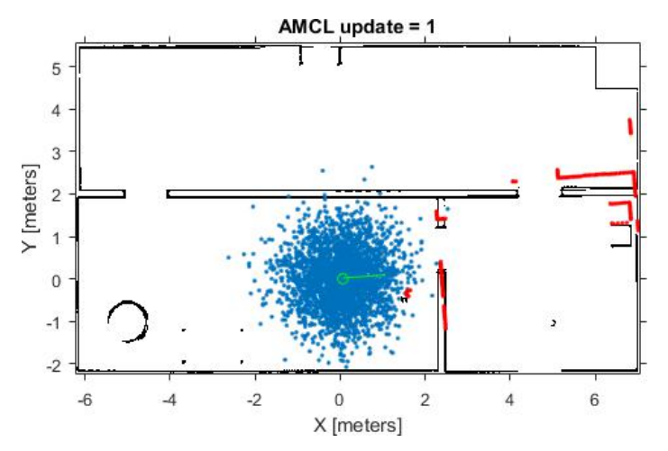

AMCL功能包中的话题和服务


实际上初始位姿可以通过参数提供也可以使用默认初始值，我们主要是要将scan（激光）、tf和map主题提供给amcl。

相关链接: http://wiki.ros.org/amcl

里程计本身也是可以协助机器人定位的，不过里程计存在累计误差且一些特殊情况时(车轮打滑)会出现定位错误的情况，amcl 则可以通过估算机器人在地图坐标系下的姿态，再结合里程计提高定位准确度。

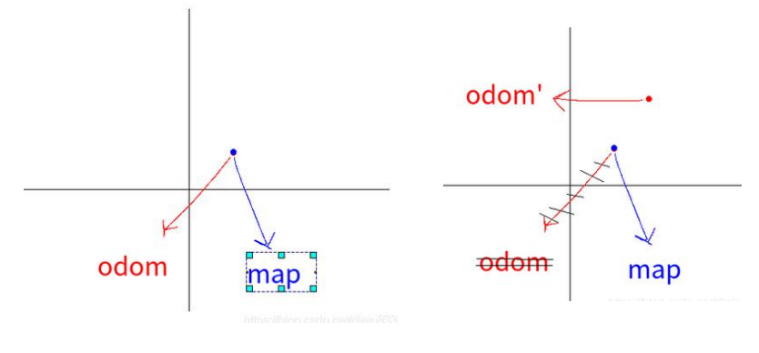

里程计定位:只是通过里程计数据实现/odom_frame 与 /base_frame 之间的坐标变换。
amcl定位: 可以提供 /map_frame 、/odom_frame 与 /base_frame 之间的坐标变换。

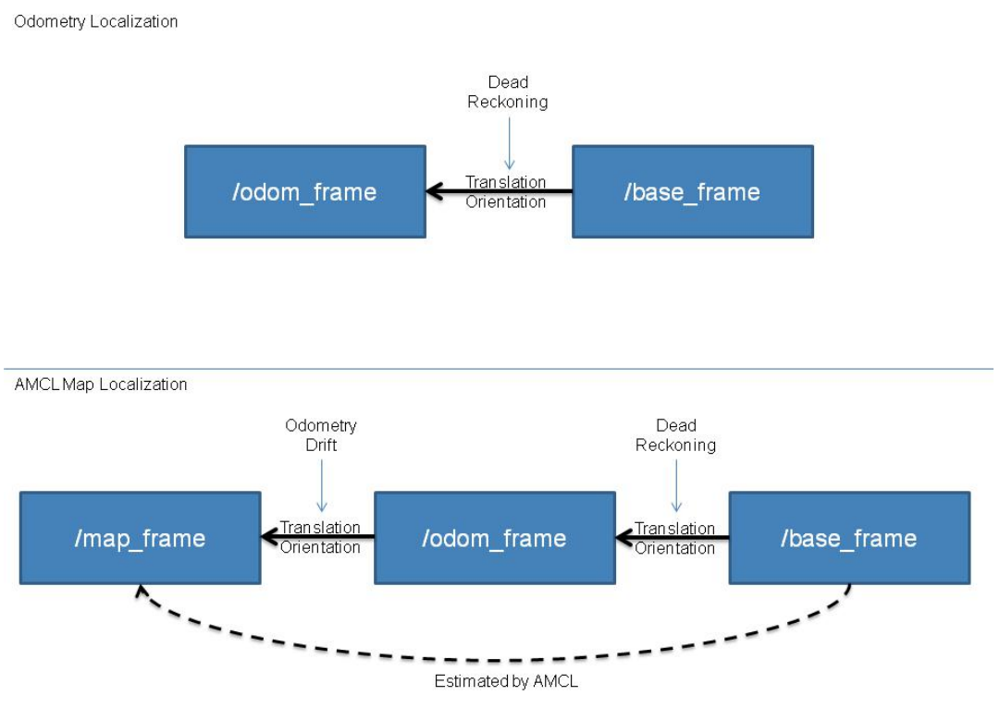

AMCL中的一些重要参数

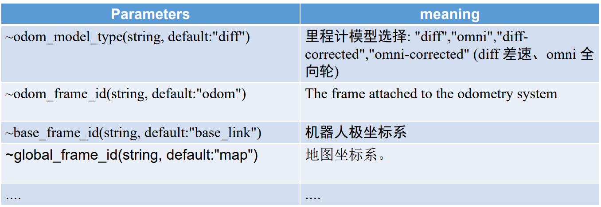

#### 7、Code for smartcar

##### 1) Creating a catkin Packag

`cd ~/smartcar_ws/src`

`catkin_create_pkg smartcar_navigation roscpp rospy sensor_msgs geometry_msgs move_base_msgs`

##### 2) Write a launch file for amcl

`cd ~/smartcar_ws/src/smartcar_navigation`

`mkdir launch`

`cd launch`

`touch amcl.launch`

Code

```html
<launch>
	<node pkg="amcl" type="amcl" name="amcl" output="screen">
		<!-- Publish scans from best pose at a max of 10 Hz -->
		<!--可视化扫描和路径信息的最大周期-->
		<!--例如: 10Hz＝0.1秒，-1.0 则被禁用-->
		<param name="gui_publish_rate" value="10.0"/>

		<param name="laser_max_beams" value="30"/>

		<param name="min_particles" value="500"/> <!--允许的最小粒子数量-->
		<param name="max_particles" value="5000"/> <!--允许的最大粒子数量（越大越好)-->

		<param name="update_min_d" value="0.2"/> <!--执行滤波器更新之前所需的平移运动（以米为单位）-->
		<param name="update_min_a" value="0.5"/> <!--执行滤波器更新之前所需的旋转运动（以弧 度为单位-->
		<param name="kld_err" value="0.05"/> <!--实际分布与估计分布之间的最大误差-->
		<param name="kld_z" value="0.99"/>

		<param name="resample_interval" value="1"/> <!--重采样间隔 -->

		<param name="transform_tolerance" value="0.1"/> <!--允许的转换时间（以秒为单位）-->

		<param name="recovery_alpha_slow" value="0.0"/> <!--指数衰减率-->
		<param name="recovery_alpha_fast" value="0.0"/> <!--指数衰减率-->

		<!--Laser model parameters-->
		<param name="laser_z_hit" value="0.5"/>
		<param name="laser_z_short" value="0.05"/>
		<param name="laser_z_max" value="0.05"/>
		<param name="laser_z_rand" value="0.5"/>
		<param name="laser_sigma_hit" value="0.2"/>
		<param name="laser_lambda_short" value="0.1"/>

		<!-- Maximum distance to do obstacle inflation on map-->
		<param name="laser_likelihood_max_dist" value="2.0"/>
		<param name="laser_model_type" value="likelihood_field"/>
		<!-- <param name="laser_model_type" value="beam"/> -->

		<!-- Odometry model parameters-->
		<param name="odom_model_type" value="diff"/>
		<param name="odom_alpha5" value="0.1"/>
		<param name="odom_alpha1" value="0.2"/>
		<param name="odom_alpha2" value="0.2"/>
		<param name="odom_alpha3" value="0.8"/>
		<param name="odom_alpha4" value="0.2"/>
		<param name="odom_frame_id" value="odom"/> <!-- 里程计坐标系 -->
		<param name="base_frame_id" value="base_footprint"/> <!--添加机器人基坐标系-->
		<param name="global_frame_id" value="map"/> <!--添加地图坐标系-->
		<remap from="scan" to="/limo/scan" />  
	</node>
</launch>
```

##### 3) Write a launch file for testing AMCL

The AMCL node cannot be run independently. It is necessary to load the global map first, and then start RVIZ to display the localizing results.

`cd ~/smartcar_ws/src/smartcar_navigation`

`mkdir launch`

`cd launch`

`touch smartcar_amcl.launch`

Code
**更改map_server的参数至建图部分的yaml文件路径**

```html
<launch>
	<arg name="map" default="My.yaml"/>
	<node name="map_server" pkg="map_server" type="map_server" args="/home/hqlab/Downloads/$(arg map)"/>
	<include file="$(find smartcar_navigation)/launch/amcl.launch"/>
	<node pkg="rviz" type="rviz" name="rviz"/>
</launch>
```
##### 4) Steps to run AMCL

`roslaunch limo_gazebo_sim limo_four_diff.launch`

`rosrun rqt_tf_tree rqt_tf_tree`

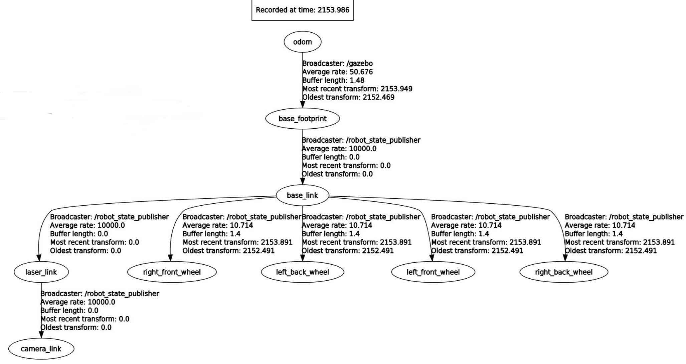

`roslaunch smartcar_navigation smartcar_amcl.launch`

`rosrun rqt_tf_tree rqt_tf_tree`


#### 8、Result

The result of acml is like below (remember open pose and map topic):

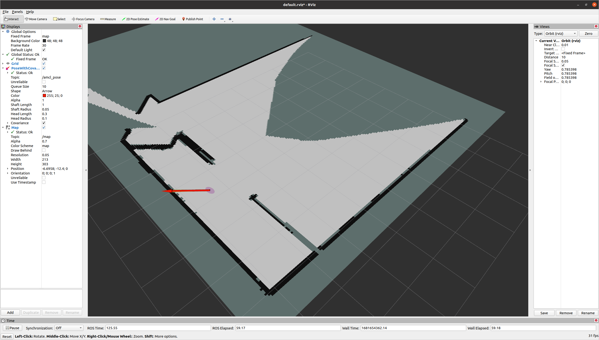

## Lab Task

Based on the Lab Project we provided, you are required to complete the following tasks:

1、Using the three SLAM algorithms (gmapping /hector/cartographer), building maps of the maze environment respectively and compare them. Write a lab report, the report contains code, steps, results, results analysis, and other contents you want to share!
2、Create pokenmon_navigation package,add amcl to the package ,and then test it and get the desired results.
Finally submit the report comparing the three SLAM and the zip file of pokemon_ws to BB.
