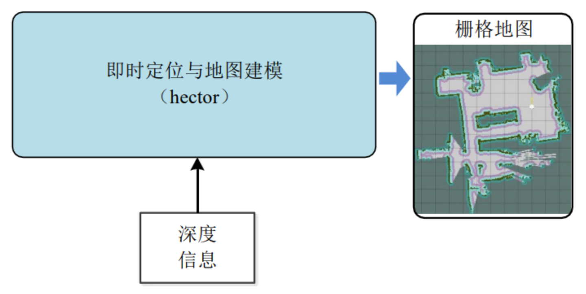
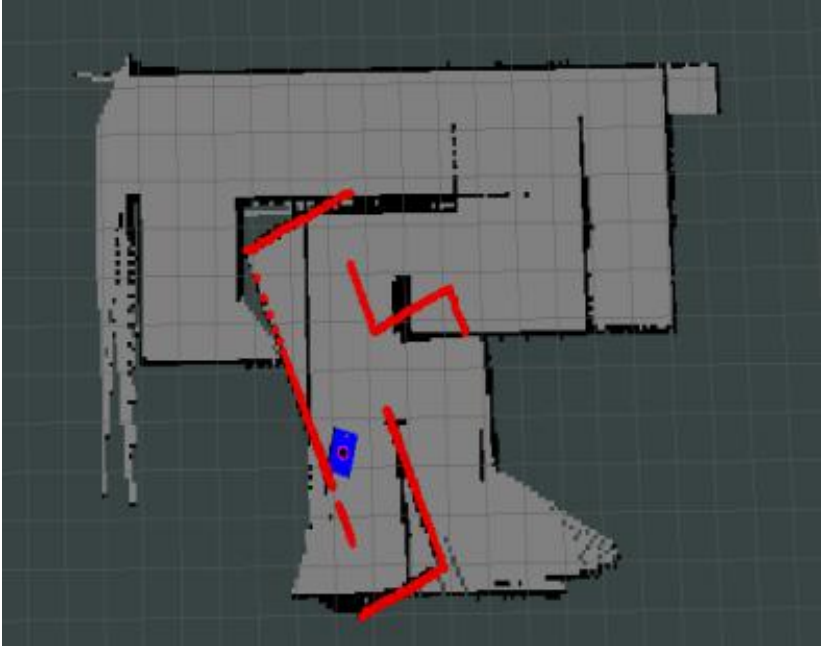

# IR_LAB 9 Tutorial

## Comparison of three SLAM(gmapping、hector、cartographer) algorithms

### Gmapping

#### 1、Introduction

1) 基于激光雷达
2) Rao-Blackwellized粒子滤波算法
3) 二维栅格网络
4) 需要机器人提供里程计信息
5) OpenSlam开源算法
6) 输出地图话题：nav_msgs/OccupancyGrid


论文可参考：http://openslam.org/gmapping/html

#### 2、Code for turtlebot3

You can create a launch file with the following code and run it in your world with turtlebot3.
```html
<launch>
	<!-- Arguments -->
	<arg name="model" default="$(env TURTLEBOT3_MODEL)" doc="model type [burger, waffle, waffle_pi]"/>
	<arg name="configuration_basename" default="turtlebot3_lds_2d.lua"/>
	<arg name="set_base_frame" default="base_footprint"/>
	<arg name="set_odom_frame" default="odom"/>
	<arg name="set_map_frame"  default="map"/>
	<arg name="multi_robot_name" default=""/>
	<arg name="open_rviz" default="true"/>

	<!-- TurtleBot3 -->
	<arg name="urdf_file" default="$(find xacro)/xacro --inorder '$(find turtlebot3_description)/urdf/turtlebot3_$(arg model).urdf.xacro'" />
	<param name="robot_description" command="$(arg urdf_file)" />

	<node pkg="robot_state_publisher" type="robot_state_publisher" name="robot_state_publisher">
		<param name="publish_frequency" type="double" value="50.0" />
		<param name="tf_prefix" value="$(arg multi_robot_name)"/>
	</node>

	<!-- Gmapping -->
	<node pkg="gmapping" type="slam_gmapping" name="turtlebot3_slam_gmapping" output="screen">
		<param name="base_frame" value="$(arg set_base_frame)"/>
		<param name="odom_frame" value="$(arg set_odom_frame)"/>
		<param name="map_frame"  value="$(arg set_map_frame)"/>
		<rosparam command="load" file="$(find turtlebot3_slam)/config/gmapping_params.yaml" />
	</node>

	<!-- rviz -->
	<group if="$(arg open_rviz)"> 
		<node pkg="rviz" type="rviz" name="rviz" args="-d $(find pokemon_navigation)/config/single.rviz"/>
	</group>

</launch>
```
#### 3、Result:


### Hector_slam

#### 1、Introduction
1) 基于激光雷达
2) 高斯牛顿法
3) 二维栅格网络
4) 不需要里程计数据
5) 输出地图话题：nav_msgs/OccupancyGrid



#### 2、Topics and services of hector


#### 3、Tf transform of hector


#### 4、Install hector_slam

Package installation

`sudo apt-get install ros-noetic-hector-mapping`

Source installation
`For source installation, https://github.com/tu-darmstadt-ros-pkg/hector_slam.git`

#### 5、Code for smartcar

##### 1) Configure hector

Create launch file
`cd ~/smartcar/src/smartcar_slam/launch`
`touch smartcar_hector.launch`

Code:
```html
<launch>
	<node pkg = "hector_mapping" type="hector_mapping" name="hector_mapping" output="screen">
		<!-- Frame names-->
		<param name="pub_map _odom_transform" value="true"/>
		<param name="map_frame" value="map" />
		<param name="base_frame" value="base_footprint" />
		<param name="odom_frame" value="odom" />

		<!--Tf use-->
		<param name="use_tf_scan_transformation" value="true"/>
		<param name="use_tf_pose_start_estimate" value="false"/>

		<!--Map size/start point-->
		<param name="map_resolution" value="0.05"/>
		<param name="map_size" value="2048"/>
		<param name="map＿start_x" value="0.5"/>
		<param name="map_start_y" value="0.5" />
		<param name="laser_z min_value" value = "-1.0" />
		<param name="laser_z_max_value" value ="1.0"/>
		<param name="map_multi_res_levels" value="2" />

		<param name="map_pub_period" value="2" />
		<param name="laser_min_dist" value="0.4"/>
		<param name="laser_max_dist" value="5.5" />
		<param name="output_timing" value="false" />
		<param name="pub_map_scanmatch_transform" value="true" />

		<!--Map update parameters-->
		<param name="update_factor_free" value="0.4"/>
		<param name="update_factor _occupied" value="0.7" />
		<param name="map_update_distance_thresh" value="0.2"/>
		<param name="map_update_angle_thresh" value="0.06"/>

		<!--Advertising config-->
		<param name="advertise_ map_service" value="true"/>
		<param name="scan_subscriber_queue_size" value="5"/>
		<param name="scan_topic" value="scan"/>
	</node>

</launch>
```
##### 2) Running hector_slam in Simulation

`roslaunch smartcar_gazebo smartcar_with_laser_nav.launch`
`roslaunch smartcar_slam smartcar_hector.launch`
`roslaunch smartcar_teleop smartcar_teleop.launch`

##### 3) Save map

Code:
```html
<launch>
	<arg name="filename" value="$(find smartcar_slam/map/mazze_hector)"/>
	<node name = "map_save" pkg="map_server" type="map_saver" args="-f $(aarg filename)"/>
</launch>
```
Run following to save map
`roslaunch smartcar_slam smartcar_savemap.launch`

#### 6、Code for turtlebot3

You can create a launch file with the following code and run it in your world with turtlebot3.
```html
<launch>
	<!-- Arguments -->
	<arg name="model" default="$(env TURTLEBOT3_MODEL)" doc="model type [burger, waffle, waffle_pi]"/>
	<arg name="configuration_basename" default="turtlebot3_lds_2d.lua"/>
	<arg name="odom_frame" default="odom"/>
	<arg name="base_frame" default="base_footprint"/>
	<arg name="scan_subscriber_queue_size" default="5"/>
	<arg name="scan_topic" default="scan"/>
	<arg name="map_size" default="2048"/>
	<arg name="pub_map_odom_transform" default="true"/>
	<arg name="tf_map_scanmatch_transform_frame_name" default="scanmatcher_frame"/>
	<arg name="multi_robot_name" default=""/>

	<!-- TurtleBot3 -->
	<arg name="urdf_file" default="$(find xacro)/xacro --inorder '$(find turtlebot3_description)/urdf/turtlebot3_$(arg model).urdf.xacro'" />
	<param name="robot_description" command="$(arg urdf_file)" />

	<node pkg="robot_state_publisher" type="robot_state_publisher" name="robot_state_publisher">
		<param name="publish_frequency" type="double" value="50.0" />
		<param name="tf_prefix" value="$(arg multi_robot_name)"/>
	</node>

	<!-- Hector mapping -->
	<node pkg="hector_mapping" type="hector_mapping" name="hector_mapping" output="screen">
		<!-- Frame names -->
		<param name="map_frame"  value="map" />
		<param name="odom_frame" value="$(arg odom_frame)" />
		<param name="base_frame" value="$(arg base_frame)" />

		<!-- Tf use -->
		<param name="use_tf_scan_transformation"  value="true"/>
		<param name="use_tf_pose_start_estimate"  value="false"/>
		<param name="pub_map_scanmatch_transform" value="true" />
		<param name="pub_map_odom_transform"      value="$(arg pub_map_odom_transform)"/>
		<param name="tf_map_scanmatch_transform_frame_name" value="$(arg tf_map_scanmatch_transform_frame_name)" />

		<!-- Map size / start point -->
		<param name="map_resolution" value="0.050"/>
		<param name="map_size"       value="$(arg map_size)"/>
		<param name="map_start_x"    value="0.5"/>
		<param name="map_start_y"    value="0.5" />
		<param name="map_multi_res_levels" value="2" />

		<!-- Map update parameters -->
		<param name="update_factor_free"         value="0.4"/>
		<param name="update_factor_occupied"     value="0.9" />   
		<param name="map_update_distance_thresh" value="0.1"/>
		<param name="map_update_angle_thresh"    value="0.04" />
		<param name="map_pub_period"             value="2" />
		<param name="laser_z_min_value"          value= "-0.1" />
		<param name="laser_z_max_value"          value= "0.1" />
		<param name="laser_min_dist"             value="0.12" />
		<param name="laser_max_dist"             value="3.5" />

		<!-- Advertising config -->
		<param name="advertise_map_service"      value="true"/> 
		<param name="scan_subscriber_queue_size" value="$(arg scan_subscriber_queue_size)"/>
		<param name="scan_topic" value="$(arg scan_topic)"/>

		<!-- Debug parameters -->
		<!--
		<param name="output_timing"    value="false"/>
		<param name="pub_drawings"     value="true"/>
		<param name="pub_debug_output" value="true"/>
		-->
	</node>
</launch>
```
#### 7、Result


#### 8、hector_slam过程中会出现打滑显现




### cartographer
