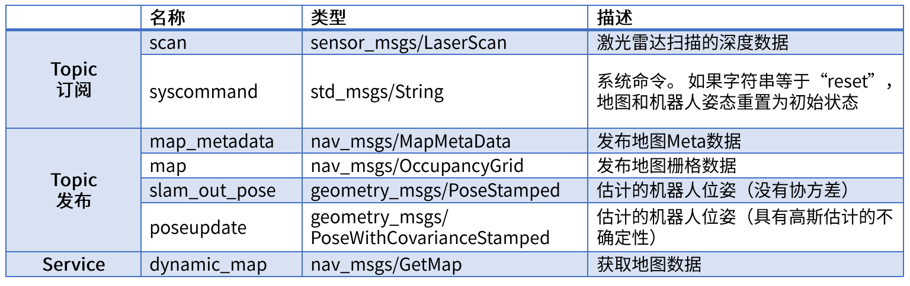
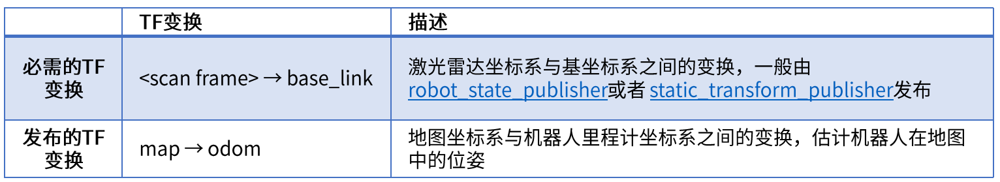

# IR_LAB 9 Tutorial

## Comparison of three SLAM(gmapping、hector、cartographer) algorithms

### Gmapping

#### 1、Introduction

1) 基于激光雷达
2) Rao-Blackwellized粒子滤波算法
3) 二维栅格网络
4) 需要机器人提供里程计信息
5) OpenSlam开源算法
6) 输出地图话题：nav_msgs/OccupancyGrid


论文可参考：http://openslam.org/gmapping/html

#### 2、Code for turtlebot3

You can create a launch file with the following code and run it in your world with turtlebot3.
```html
<launch>
	<!-- Arguments -->
	<arg name="model" default="$(env TURTLEBOT3_MODEL)" doc="model type [burger, waffle, waffle_pi]"/>
	<arg name="configuration_basename" default="turtlebot3_lds_2d.lua"/>
	<arg name="set_base_frame" default="base_footprint"/>
	<arg name="set_odom_frame" default="odom"/>
	<arg name="set_map_frame"  default="map"/>
	<arg name="multi_robot_name" default=""/>
	<arg name="open_rviz" default="true"/>

	<!-- TurtleBot3 -->
	<arg name="urdf_file" default="$(find xacro)/xacro --inorder '$(find turtlebot3_description)/urdf/turtlebot3_$(arg model).urdf.xacro'" />
	<param name="robot_description" command="$(arg urdf_file)" />

	<node pkg="robot_state_publisher" type="robot_state_publisher" name="robot_state_publisher">
		<param name="publish_frequency" type="double" value="50.0" />
		<param name="tf_prefix" value="$(arg multi_robot_name)"/>
	</node>

	<!-- Gmapping -->
	<node pkg="gmapping" type="slam_gmapping" name="turtlebot3_slam_gmapping" output="screen">
		<param name="base_frame" value="$(arg set_base_frame)"/>
		<param name="odom_frame" value="$(arg set_odom_frame)"/>
		<param name="map_frame"  value="$(arg set_map_frame)"/>
		<rosparam command="load" file="$(find turtlebot3_slam)/config/gmapping_params.yaml" />
	</node>

	<!-- rviz -->
	<group if="$(arg open_rviz)"> 
		<node pkg="rviz" type="rviz" name="rviz" args="-d $(find pokemon_navigation)/config/single.rviz"/>
	</group>

</launch>
```
#### 3、Result:


### Hector_slam

#### 1、Introduction
1) 基于激光雷达
2) 高斯牛顿法
3) 二维栅格网络
4) 不需要里程计数据
5) 输出地图话题：nav_msgs/OccupancyGrid


#### 2、Topics and services of hector




#### 3、Tf transform of hector



#### 4、Install hector_slam

Package installation

`sudo apt-get install ros-noetic-hector-mapping`

Source installation
`For source installation, https://github.com/tu-darmstadt-ros-pkg/hector_slam.git`

#### 5、Code for smartcar

##### 1) Configure hector

Create launch file
`cd ~/smartcar/src/smartcar_slam/launch`

`touch smartcar_hector.launch`

Code:
```html
<launch>
	<node pkg = "hector_mapping" type="hector_mapping" name="hector_mapping" output="screen">
		<!-- Frame names-->
		<param name="pub_map _odom_transform" value="true"/>
		<param name="map_frame" value="map" />
		<param name="base_frame" value="base_footprint" />
		<param name="odom_frame" value="odom" />

		<!--Tf use-->
		<param name="use_tf_scan_transformation" value="true"/>
		<param name="use_tf_pose_start_estimate" value="false"/>

		<!--Map size/start point-->
		<param name="map_resolution" value="0.05"/>
		<param name="map_size" value="2048"/>
		<param name="map＿start_x" value="0.5"/>
		<param name="map_start_y" value="0.5" />
		<param name="laser_z min_value" value = "-1.0" />
		<param name="laser_z_max_value" value ="1.0"/>
		<param name="map_multi_res_levels" value="2" />

		<param name="map_pub_period" value="2" />
		<param name="laser_min_dist" value="0.4"/>
		<param name="laser_max_dist" value="5.5" />
		<param name="output_timing" value="false" />
		<param name="pub_map_scanmatch_transform" value="true" />

		<!--Map update parameters-->
		<param name="update_factor_free" value="0.4"/>
		<param name="update_factor _occupied" value="0.7" />
		<param name="map_update_distance_thresh" value="0.2"/>
		<param name="map_update_angle_thresh" value="0.06"/>

		<!--Advertising config-->
		<param name="advertise_ map_service" value="true"/>
		<param name="scan_subscriber_queue_size" value="5"/>
		<param name="scan_topic" value="scan"/>
	</node>

</launch>
```
##### 2) Running hector_slam in Simulation

`roslaunch smartcar_gazebo smartcar_with_laser_nav.launch`

`roslaunch smartcar_slam smartcar_hector.launch`

`roslaunch smartcar_teleop smartcar_teleop.launch`

##### 3) Save map

Code:
```html
<launch>
	<arg name="filename" value="$(find smartcar_slam/map/maze_hector)"/>
	<node name = "map_save" pkg="map_server" type="map_saver" args="-f $(aarg filename)"/>
</launch>
```
Run following to save map
`roslaunch smartcar_slam smartcar_savemap.launch`

#### 6、Code for turtlebot3

You can create a launch file with the following code and run it in your world with turtlebot3.
```html
<launch>
	<!-- Arguments -->
	<arg name="model" default="$(env TURTLEBOT3_MODEL)" doc="model type [burger, waffle, waffle_pi]"/>
	<arg name="configuration_basename" default="turtlebot3_lds_2d.lua"/>
	<arg name="odom_frame" default="odom"/>
	<arg name="base_frame" default="base_footprint"/>
	<arg name="scan_subscriber_queue_size" default="5"/>
	<arg name="scan_topic" default="scan"/>
	<arg name="map_size" default="2048"/>
	<arg name="pub_map_odom_transform" default="true"/>
	<arg name="tf_map_scanmatch_transform_frame_name" default="scanmatcher_frame"/>
	<arg name="multi_robot_name" default=""/>

	<!-- TurtleBot3 -->
	<arg name="urdf_file" default="$(find xacro)/xacro --inorder '$(find turtlebot3_description)/urdf/turtlebot3_$(arg model).urdf.xacro'" />
	<param name="robot_description" command="$(arg urdf_file)" />

	<node pkg="robot_state_publisher" type="robot_state_publisher" name="robot_state_publisher">
		<param name="publish_frequency" type="double" value="50.0" />
		<param name="tf_prefix" value="$(arg multi_robot_name)"/>
	</node>

	<!-- Hector mapping -->
	<node pkg="hector_mapping" type="hector_mapping" name="hector_mapping" output="screen">
		<!-- Frame names -->
		<param name="map_frame"  value="map" />
		<param name="odom_frame" value="$(arg odom_frame)" />
		<param name="base_frame" value="$(arg base_frame)" />

		<!-- Tf use -->
		<param name="use_tf_scan_transformation"  value="true"/>
		<param name="use_tf_pose_start_estimate"  value="false"/>
		<param name="pub_map_scanmatch_transform" value="true" />
		<param name="pub_map_odom_transform"      value="$(arg pub_map_odom_transform)"/>
		<param name="tf_map_scanmatch_transform_frame_name" value="$(arg tf_map_scanmatch_transform_frame_name)" />

		<!-- Map size / start point -->
		<param name="map_resolution" value="0.050"/>
		<param name="map_size"       value="$(arg map_size)"/>
		<param name="map_start_x"    value="0.5"/>
		<param name="map_start_y"    value="0.5" />
		<param name="map_multi_res_levels" value="2" />

		<!-- Map update parameters -->
		<param name="update_factor_free"         value="0.4"/>
		<param name="update_factor_occupied"     value="0.9" />   
		<param name="map_update_distance_thresh" value="0.1"/>
		<param name="map_update_angle_thresh"    value="0.04" />
		<param name="map_pub_period"             value="2" />
		<param name="laser_z_min_value"          value= "-0.1" />
		<param name="laser_z_max_value"          value= "0.1" />
		<param name="laser_min_dist"             value="0.12" />
		<param name="laser_max_dist"             value="3.5" />

		<!-- Advertising config -->
		<param name="advertise_map_service"      value="true"/> 
		<param name="scan_subscriber_queue_size" value="$(arg scan_subscriber_queue_size)"/>
		<param name="scan_topic" value="$(arg scan_topic)"/>

		<!-- Debug parameters -->
		<!--
		<param name="output_timing"    value="false"/>
		<param name="pub_drawings"     value="true"/>
		<param name="pub_debug_output" value="true"/>
		-->
	</node>
</launch>
```
#### 7、Result


#### 8、hector_slam过程中会出现打滑显现


### Cartographer

#### 1、Introduction

1) 2016年10月5日，谷歌开源
2) 二维或三维条件下的定位及建图功能
3) 设计目的是在计算资源有限的情况下，实时获取相对较高精度的2D地图
4) cartographer采用基于图网络的优化方法
5) 目前cartographer主要基于激光雷达来实现SLAM
6) 谷歌希望通过后续的开发及社区的贡献支持更多的传感器和机器人平台，同时不断增加新的功能


相关链接：
https://github.com/googlecartographer/cartographer_turtlebot
https://google-cartographer-ros.readthedocs.io/en/latest/
http://wiki.ros.org/cartographer

#### 2、Install cartographer

Package installation
`sudo apt-get install ros-noetic-cartographer-*`

#### 3、Code for smartcar

##### 1) Configure cartographer

Create launch file
`cd ~/smartcar/src/smartcar_slam/launch`

`touch smartcar_cartographer.launch`

Code
```html
<launch>
	<param name="/use_sim_time" value="true" />
	<node name="cartographer_node" pkg="cartographer_ros" type="cartographer_node" args="-configuration_directory $(find smartcar_slam)/config -configuration_basename lidar.lua" output="screen">
		<remap from="scan" to="scan" />
	</node>

	<!--cartographer_occupancy_grid_node-->
	<node pkg="cartographer_ros" type="cartographer_occupancy_grid_node" name="cartographer_occupancy grid_node" args="-resolution 0.05" />

	<node name="rviz" pkg="rviz" type="rviz" required="true" args="-d$(find cartographer_ros)/configuration_files/demo_2d.rviz" />
</launch>
```

##### 2)Parameter configuration

File path
`~/smartcar_ws/src/smartcar_slam/config/lidar.lua`

Code
```c
-- Copyright 2016 The Cartographer Authors
--
-- Licensed under the Apache License, Version 2.0 (the "License");
-- you may not use this file except in compliance with the License.
-- You may obtain a copy of the License at
--
-- http://www.apache.org/licenses/LICENSE-2.0
--
-- Unless required by applicable law or agreed to in writing, software
-- distributed under the License is distributed on an "AS IS" BASIS,
-- WITHOUT WARRANTIES OR CONDITIONS OF ANY KIND, either express or implied.
-- See the License for the specific language governing permissions and
-- limitations under the License.

include "map_builder.lua"
include "trajectory_builder.lua"

options = {
	map_builder = MAP_BUILDER,
	trajectory_builder = TRAJECTORY_BUILDER,
	map_frame = "map",
	tracking_frame = "base_footprint",
	published_frame = "base_footprint",
	odom_frame = "odom",
	provide_odom_frame = true,
	publish_frame_projected_to_2d = false,
	use_odometry = true,
	use_nav_sat = false,
	use_landmarks = false,
	num_laser_scans = 1,
	num_multi_echo_laser_scans = 0,
	num_subdivisions_per_laser_scan = 1,
	num_point_clouds = 0,
	lookup_transform_timeout_sec = 0.2,
	submap_publish_period_sec = 0.3,
	pose_publish_period_sec = 5e-3,
	trajectory_publish_period_sec = 30e-3,
	rangefinder_sampling_ratio = 1.,
	odometry_sampling_ratio = 1.,
	fixed_frame_pose_sampling_ratio = 1.,
	imu_sampling_ratio = 1.,
	landmarks_sampling_ratio = 1.,
}

MAP_BUILDER.use_trajectory_builder_2d = true

TRAJECTORY_BUILDER_2D.submaps.num_range_data = 35
TRAJECTORY_BUILDER_2D.min_range = 0.3
TRAJECTORY_BUILDER_2D.max_range = 8
TRAJECTORY_BUILDER_2D.missing_data_ray_length = 1.
TRAJECTORY_BUILDER_2D.use_imu_data = false
TRAJECTORY_BUILDER_2D.use_online_correlative_scan_matching = true
TRAJECTORY_BUILDER_2D.real_time_correlative_scan_matcher.linear_search_window = 0.1
TRAJECTORY_BUILDER_2D.real_time_correlative_scan_matcher.translation_delta_cost_
weight = 10.
TRAJECTORY_BUILDER_2D.real_time_correlative_scan_matcher.rotation_delta_cost_wei
ght = 1e-1

POSE_GRAPH.optimization_problem.huber_scale = 1e2
POSE_GRAPH.optimize_every_n_nodes = 35
POSE_GRAPH.constraint_builder.min_score = 0.65

return options
```

##### 3) Running Cartographer in Simulation

`roslaunch smartcar_gazebo smartcar_with_laser_nav.launch`

`roslaunch smartcar_slam smartcar_cartographer.launch`

`roslaunch smartcar_teleop smartcar_teleop.launch`

##### 4) Save map

Code:
```html
<launch>
	<arg name="filename" value="$(find smartcar_slam/map/maze_cartographer)"/>
	<node name = "map_save" pkg="map_server" type="map_saver" args="-f $(aarg filename)"/>
</launch>
```
Run following to save map
`roslaunch smartcar_slam smartcar_savemap.launch`

#### 4、Code for turtlebot3

You can create a launch file with the following code and run it in your world with turtlebot3.
```html
<launch>
	<!-- Arguments -->
	<arg name="model" default="$(env TURTLEBOT3_MODEL)" doc="model type [burger, waffle, waffle_pi]"/>
	<arg name="configuration_basename" default="turtlebot3_lds_2d_gazebo.lua"/>
	<arg name="multi_robot_name" default=""/>
	<arg name="cmd_vel_topic" default="/cmd_vel" />
	<arg name="odom_topic" default="odom" />
	<arg name="move_forward_only" default="false"/>

	<!-- TurtleBot3 -->
	<arg name="urdf_file" default="$(find xacro)/xacro --inorder '$(find turtlebot3_description)/urdf/turtlebot3_$(arg model).urdf.xacro'" />
	<param name="robot_description" command="$(arg urdf_file)" />

	<node pkg="robot_state_publisher" type="robot_state_publisher" name="robot_state_publisher">
		<param name="publish_frequency" type="double" value="50.0" />
		<param name="tf_prefix" value="$(arg multi_robot_name)"/>
	</node>

	<!-- move_base -->
	<node pkg="move_base" type="move_base" respawn="false" name="move_base" output="screen">
		<param name="base_local_planner" value="dwa_local_planner/DWAPlannerROS" />
		<rosparam file="$(find turtlebot3_navigation)/param/costmap_common_params_$(arg model).yaml" command="load" ns="global_costmap" />
		<rosparam file="$(find turtlebot3_navigation)/param/costmap_common_params_$(arg model).yaml" command="load" ns="local_costmap" />
		<rosparam file="$(find turtlebot3_navigation)/param/local_costmap_params.yaml" command="load" />
		<rosparam file="$(find turtlebot3_navigation)/param/global_costmap_params.yaml" command="load" />
		<rosparam file="$(find turtlebot3_navigation)/param/move_base_params.yaml" command="load" />
		<rosparam file="$(find turtlebot3_navigation)/param/dwa_local_planner_params_$(arg model).yaml" command="load" />
		<remap from="cmd_vel" to="$(arg cmd_vel_topic)"/>
		<remap from="odom" to="$(arg odom_topic)"/>
		<param name="DWAPlannerROS/min_vel_x" value="0.0" if="$(arg move_forward_only)" />
	</node>

	<!-- cartographer_node -->
	<node pkg="cartographer_ros" type="cartographer_node" name="cartographer_node" args="-configuration_directory $(find turtlebot3_slam)/config -configuration_basename $(arg configuration_basename)" output="screen">
		<remap from="/imu" to="/flat_imu"/>
	</node>

	<!-- cartographer_occupancy_grid_node -->
	<node pkg="cartographer_ros" type="cartographer_occupancy_grid_node" name="cartographer_occupancy_grid_node"  args="-resolution 0.05" />

	<!-- flat_world_imu_node -->
	<node pkg="turtlebot3_slam" type="flat_world_imu_node" name="flat_world_imu_node" output="screen">
		<remap from="imu_in" to="/imu" />
		<remap from="imu_out" to="/flat_imu" />
	</node>
</launch>
```

#### 5、Result


## Localization
