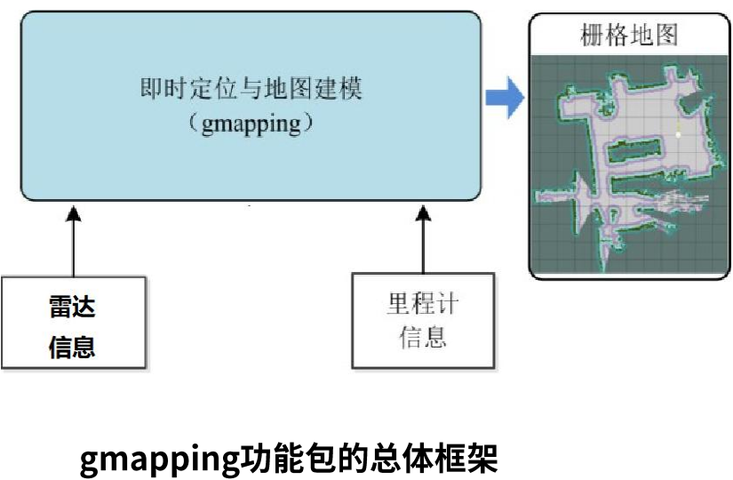

# IR_LAB 9 Tutorial

## Comparison of three SLAM(gmapping、hector、cartographer) algorithms

### gmapping

#### gmapping功能包
##### 1、introduction
1) 基于激光雷达
2) Rao-Blackwellized粒子滤波算法
3) 二维栅格网络
4) 需要机器人提供里程计信息
5) OpenSlam开源算法
6) 输出地图话题：nav_msgs/OccupancyGrid



论文可参考：http://openslam.org/gmapping/html

##### 2、code in turtlebot3
```html
<launch>
  <!-- Arguments -->
  <arg name="model" default="$(env TURTLEBOT3_MODEL)" doc="model type [burger, waffle, waffle_pi]"/>
  <arg name="configuration_basename" default="turtlebot3_lds_2d.lua"/>
  <arg name="set_base_frame" default="base_footprint"/>
  <arg name="set_odom_frame" default="odom"/>
  <arg name="set_map_frame"  default="map"/>
  <arg name="multi_robot_name" default=""/>
  <arg name="open_rviz" default="true"/>

  <!-- TurtleBot3 -->
  <arg name="urdf_file" default="$(find xacro)/xacro --inorder '$(find turtlebot3_description)/urdf/turtlebot3_$(arg model).urdf.xacro'" />
  <param name="robot_description" command="$(arg urdf_file)" />

  <node pkg="robot_state_publisher" type="robot_state_publisher" name="robot_state_publisher">
    <param name="publish_frequency" type="double" value="50.0" />
    <param name="tf_prefix" value="$(arg multi_robot_name)"/>
  </node>

  <!-- Gmapping -->
  <node pkg="gmapping" type="slam_gmapping" name="turtlebot3_slam_gmapping" output="screen">
    <param name="base_frame" value="$(arg set_base_frame)"/>
    <param name="odom_frame" value="$(arg set_odom_frame)"/>
    <param name="map_frame"  value="$(arg set_map_frame)"/>
    <rosparam command="load" file="$(find turtlebot3_slam)/config/gmapping_params.yaml" />
  </node>

  <!-- rviz -->
  <group if="$(arg open_rviz)"> 
    <node pkg="rviz" type="rviz" name="rviz" args="-d $(find pokemon_navigation)/config/single.rviz"/>
  </group>

</launch>
```
Result:


### hector_slam

### cartographer
