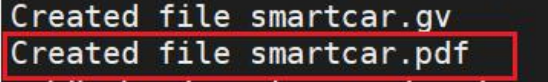
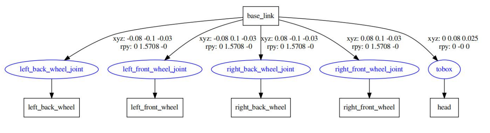

# LAB5 - 3D Modeling and Simulation

-- Course: *Intelligent Robotics – Professor: Qi Hao*

-- Environment: Ubuntu 20.04, ros-noetic

[TOC]

## Creationg our first URDF file

#### Using  URDF to Model our own robot.

 + Unified Robot Description Format, 统一机器人描述格式
 + Using an XML specification to describe a robot.
 + Consists of a set of link elements, and a set of joint elements connecting the links together.

​	

**<link>...</link>** describes rigid bodies with **inertial**, **visual and collision characteristics**. 

An example is following which describes the second example in above picture :

```xml
<link name="my_1ink">
    <inertia1>
		<origin xyz="0 0 0.5" rpy="0 0 0"/>
    	<mass value="1"/>
		<inertia ixx="100" ixy="O”" ixz="O" iyy="100" iyz="O" izz="100"/>		</inertial>
	<visual>
		<origin xyz="0 0 0"rpy="0 0 0"/>
        <geometry>
			<box size="1 1 1"/>
        </geometry>
		<materia7 name="Cyan">
			<color rgba="0 1.0 1.0 1.0"/>
        </materia1>
	</visua1>
	<co11ision>
		<origin xyz="0 0 0"rpy="0 0 0"/>
        <geometry>
			<cylinder radius="1"length="0.5"/>
        </geometry>
	</co11ision>
</link>
```

To connect multiple **<link>**, we need **<joint>**, which describes the fixed connection information such as the location between multiple <link>.

An example as following:

```xml
<?xm1 version="1.0"?>
<robot name="smartcar">
	<link name="base_1ink">
        ...
	</link>
    
	<1ink name="right_front_whee1">
        ...
	</1ink>
    
	<joint name="left_front_whee1_joint" type="continuous ">
        ...
	</joint>
</robot>
```


#### Create a URDF robot model

Create a new file in the 

<font color= blue>~/smartcar_ws/src/smartcar_description/urdf</font> folder with the name <font color=blue>smartcar.urdf</font> and enter the following code.

```xml
<?xml version="1.0"?>
<robot name="smartcar">
    <!-- 定义最基本的base_link作为小车的车体，其他link通过joint固定在该link上 -->
    <link name="base_link">
        <visual>
            <geometry>
                <box size="0.25 .16 .05" /> <!-- 选择0.25cm x 0.16cm x 0.05cm 的立方体作为小车车体 -->
            </geometry>
            <origin rpy="0 0 1.57075" xyz="0 0 0" /> <!-- 车体绕着z轴旋转90度 -->
            <material name="blue">
                <color rgba="0 0 .8 1" />
            </material>
        </visual>
    </link>
    <link name="right_front_wheel">
        <visual>
            <geometry>
                <cylinder length=".02" radius="0.025" />
            </geometry>
            <material name="black">
                <color rgba="0 0 0 1" />
            </material>
        </visual>
    </link>
    <!-- 类型为continuous，连续型的铰链关节，可以绕一个轴旋转，没有最大值和最小值限制 -->
    <joint name="right_front_wheel_joint" type="continuous">
        <axis xyz="0 0 1" /> <!-- 设置z轴为旋转轴 -->
        <parent link="base_link" /> <!-- 其父link为base_link，即车体 -->
        <child link="right_front_wheel" /> <!-- 子link为右前轮，将其固定在车体上 -->
        <!-- 由于轮子初始状态为圆柱，像图所示，因此需要将其绕着y轴旋转90度 -->
        <origin rpy="0 1.57075 0" xyz="0.08 0.1 -0.03" />
        <!-- 转动时最大力为100，最大速度也为100 -->
        <limit effort="100" velocity="100" />
        <!-- 设置阻尼值和摩擦力均为0 -->
        <joint_properties damping="0.0" friction="0.0" />
    </joint>
    <link name="right_back_wheel">
        <visual>
            <geometry>
                <cylinder length=".02" radius="0.025" />
            </geometry>
            <material name="black">
                <color rgba="0 0 0 1" />
            </material>
        </visual>
    </link>
    <joint name="right_back_wheel_joint" type="continuous">
        <axis xyz="0 0 1" />
        <parent link="base_link" />
        <child link="right_back_wheel" />
        <origin rpy="0 1.57075 0" xyz="0.08 -0.1 -0.03" />
        <limit effort="100" velocity="100" />
        <joint_properties damping="0.0" friction="0.0" />
    </joint>
    <link name="left_front_wheel">
        <visual>
            <geometry>
                <cylinder length=".02" radius="0.025" />
            </geometry>
            <material name="black">
                <color rgba="0 0 0 1" />
            </material>
        </visual>
    </link>
    <joint name="left_front_wheel_joint" type="continuous">
        <axis xyz="0 0 1" />
        <parent link="base_link" />
        <child link="left_front_wheel" />
        <origin rpy="0 1.57075 0" xyz="-0.08 0.1 -0.03" />
        <limit effort="100" velocity="100" />
        <joint_properties damping="0.0" friction="0.0" />
    </joint>
    <link name="left_back_wheel">
        <visual>
            <geometry>
                <cylinder length=".02" radius="0.025" />
            </geometry>
            <material name="black">
                <color rgba="0 0 0 1" />
            </material>
        </visual>
    </link>
    <joint name="left_back_wheel_joint" type="continuous">
        <axis xyz="0 0 1" />
        <parent link="base_link" />
        <child link="left_back_wheel" />
        <origin rpy="0 1.57075 0" xyz="-0.08 -0.1 -0.03" />
        <limit effort="100" velocity="100" />
        <joint_properties damping="0.0" friction="0.0" />
    </joint>

    <link name="head">
        <visual>
            <geometry>
                <box size=".02 .03 .03" />
            </geometry>
            <material name="white">
                <color rgba="1 1 1 1" />
            </material>
        </visual>
    </link>

    <joint name="tobox" type="fixed">
        <parent link="base_link" />
        <child link="head" />
        <origin xyz="0 0.08 0.025" />
    </joint>
</robot>
```

learn more details from: http://wiki.ros.org/urdf/XML/model

| Type of joint | Dscription                                                   |
| ------------- | ------------------------------------------------------------ |
| continuous    | a continuous hinge joint that rotates around the axis（绕axis轴旋转） |
| revolute      | a hinge joint that rotates along the axis and has a limited range specifiedbytheupper and lower limits.（绕axis轴旋转，有最大最小值限制） |
| prismatic     | a sliding joint that slides along the axis（表示沿着轴运动（滑动）而非旋转，只可以一维运动） |
| planar        | This joint allows motion in a plane perpendicular to the axis.（表示可以在与轴垂直的平面上运动（二维）） |
| floating      | This joint allows motion for all 6 degrees of freedom（表示可以任意6自由度运动） |
| fixed         | All degrees of freedom are locked.（不能运动）               |

#### Check the URDF robot model

```
$sudo apt-get install liburdfdom-tools
$cd ~/smartcar_ws/src/smartcar_description/urdf
$check_urdf smartcar.urdf
```


```
$cd ~/smartcar_ws/src/smartcar_description/urdf
$urdf_to_graphiz mcar.urdf
```





#### Watching the URDF model on rviz

Create the <font color=blue>display_smartcar_urdf.launch</font> file in the <font color=blue>smartcar_description/launch</font> folder, and put the following code in it:

```xml
<launch>
   <arg name="gui" default="False" />
    <param name="robot_description" textfile="$(find smartcar_description)/urdf/smartcar.urdf" />
    
    <!-- 设置GUI参数，显示关节控制插件 -->
    <param name="use_gui" value="$(arg gui)"/>
    
    <!-- 运行joint_state_publisher节点，发布机器人的关节状态 -->
    <node name="joint_state_publisher_gui" pkg="joint_state_publisher_gui" type="joint_state_publisher_gui" />
    
    <!-- 运行robot_state_publisher节点，发布tf -->
    <node name="robot_state_publisher" pkg="robot_state_publisher" type="robot_state_publisher" />
    
    <!-- 运行rviz可视化界面 -->
    <node name="rviz" pkg="rviz" type="rviz" args="-d $(find smartcar_description)/config/smartcar_urdf.rviz" required="true" />
</launch>
```

Launch it with the following command:

```
$cd ~/smartcar_ws
$catkin_make
$source devel/setup.bash
$roslaunch smartcar_description display_smartcar_urdf.launch
```

If the following error occurs:


Install this package:

```
$sudo apt-get install ros-melodic-joint-state-publisher-gui
```

Demo:


> Remember to add the robot model and modify the fixed frame.

#### Loading kinect to our models

Create a new file in the 

<font color= blue>~/smartcar_ws/src/smartcar_description/urdf</font> folder with the name <font color=blue>smartcar_with_kinect.urdf</font> and enter the following code.

```xml
<?xml version="1.0"?>
<robot name="smartcar">
    <!-- 定义最基本的base_link作为小车的车体，其他link通过joint固定在该link上 -->
    <link name="base_link">
        <visual>
            <geometry>
                <box size="0.25 .16 .05" /> <!-- 选择0.25cm x 0.16cm x 0.05cm 的立方体作为小车车体 -->
            </geometry>
            <origin rpy="0 0 1.57075" xyz="0 0 0" /> <!-- 车体绕着z轴旋转90度 -->
            <material name="blue">
                <color rgba="0 0 .8 1" />
            </material>
        </visual>
    </link>
    <link name="right_front_wheel">
        <visual>
            <geometry>
                <cylinder length=".02" radius="0.025" />
            </geometry>
            <material name="black">
                <color rgba="0 0 0 1" />
            </material>
        </visual>
    </link>
    <!-- 类型为continuous，连续型的铰链关节，可以绕一个轴旋转，没有最大值和最小值限制 -->
    <joint name="right_front_wheel_joint" type="continuous">
        <axis xyz="0 0 1" /> <!-- 设置z轴为旋转轴 -->
        <parent link="base_link" /> <!-- 其父link为base_link，即车体 -->
        <child link="right_front_wheel" /> <!-- 子link为右前轮，将其固定在车体上 -->
        <!-- 由于轮子初始状态为圆柱，像图所示，因此需要将其绕着y轴旋转90度 -->
        <origin rpy="0 1.57075 0" xyz="0.08 0.1 -0.03" />
        <!-- 转动时最大力为100，最大速度也为100 -->
        <limit effort="100" velocity="100" />
        <!-- 设置阻尼值和摩擦力均为0 -->
        <joint_properties damping="0.0" friction="0.0" />
    </joint>
    <link name="right_back_wheel">
        <visual>
            <geometry>
                <cylinder length=".02" radius="0.025" />
            </geometry>
            <material name="black">
                <color rgba="0 0 0 1" />
            </material>
        </visual>
    </link>
    <joint name="right_back_wheel_joint" type="continuous">
        <axis xyz="0 0 1" />
        <parent link="base_link" />
        <child link="right_back_wheel" />
        <origin rpy="0 1.57075 0" xyz="0.08 -0.1 -0.03" />
        <limit effort="100" velocity="100" />
        <joint_properties damping="0.0" friction="0.0" />
    </joint>
    <link name="left_front_wheel">
        <visual>
            <geometry>
                <cylinder length=".02" radius="0.025" />
            </geometry>
            <material name="black">
                <color rgba="0 0 0 1" />
            </material>
        </visual>
    </link>
    <joint name="left_front_wheel_joint" type="continuous">
        <axis xyz="0 0 1" />
        <parent link="base_link" />
        <child link="left_front_wheel" />
        <origin rpy="0 1.57075 0" xyz="-0.08 0.1 -0.03" />
        <limit effort="100" velocity="100" />
        <joint_properties damping="0.0" friction="0.0" />
    </joint>
    <link name="left_back_wheel">
        <visual>
            <geometry>
                <cylinder length=".02" radius="0.025" />
            </geometry>
            <material name="black">
                <color rgba="0 0 0 1" />
            </material>
        </visual>
    </link>
    <joint name="left_back_wheel_joint" type="continuous">
        <axis xyz="0 0 1" />
        <parent link="base_link" />
        <child link="left_back_wheel" />
        <origin rpy="0 1.57075 0" xyz="-0.08 -0.1 -0.03" />
        <limit effort="100" velocity="100" />
        <joint_properties damping="0.0" friction="0.0" />
    </joint>

    <link name="kinect_link">
        <visual>
            <origin xyz="0 0 0" rpy="0 0 3.14159" />
            <geometry>
                <mesh filename="package://smartcar_description/meshes/kinect.dae" />
            </geometry>
        </visual>
    </link>

    <joint name="kinect_joint" type="fixed">
        <parent link="base_link" />
        <child link="kinect_link" />
        <origin xyz="0 0.08 0.045" />
    </joint>
</robot>
```

Create the <font color=blue>display_smartcar_with_kinect_urdf.launch</font> file in the <font color=blue>smartcar_description/launch</font> folder, and put the following code in it:

```xml
<launch>
   <arg name="gui" default="False" />
	<param name="robot_description" textfile="$(find smartcar_description)/urdf/smartcar_with_kinect.urdf" />
    
    <!-- 设置GUI参数，显示关节控制插件 -->
    <param name="use_gui" value="$(arg gui)"/>
    
	<!-- 运行joint_state_publisher节点，发布机器人的关节状态 -->
	<node name="joint_state_publisher_gui" pkg="joint_state_publisher_gui"
type="joint_state_publisher_gui" />
    
	<!-- 运行robot_state_publisher节点，发布tf -->
	<node name="robot_state_publisher" pkg="robot_state_publisher"
type="robot_state_publisher" />
    
	<!-- 运行rviz可视化界面 -->
	<node name="rviz" pkg="rviz" type="rviz" args="-d $(find
smartcar_description)/config/smartcar_urdf.rviz" required="true" />
</launch>
```

Launch it with the following command:

```
$cd ~/smartcar_ws
$catkin_make
$source devel/setup.bash
$roslaunch smartcar_description display_smartcar_with_kinect_urdf.launch
```

Demo:


#### There are some problems with using urdf:

+ The code is **too long** and **repetitive**
+ Parameter modification is troublesome, which results in the maintenance of the code will become more complicated.

## Xacro —— a better way to write our robot models

#### Reduce the overall size of the model code

+ Using the “include”
+ Using macros

#### A programmable interface is provided

+ Using constants
+ Using variable
+ Using math
+ Using Conditional statements
+ ……

1. Definition and use of constants

   ```xml
   <xacro:property name="M_PI" value="3.1415926"/>  
   
   <xacro:property name="base_length" value="0.25"/>
   <xacro:property name="base_width" value="0.16"/>
   <xacro:property name="base_height" value="0.05"/>
   
   <xacro:property name="wheel_radius" value="0.025"/>
   <xacro:property name="wheel_length" value="0.02"/>
   ```

   ```xml
   <link name="base_link">
       <visual>
           <geometry>
               <box size="${base_length} ${base_width} ${base_height}"/>
           </geometry>
           <origin rpy="0 0 ${M_PI/2}" xyz="0 0 0"/>
           <material name="blue">
               <color rgba="0.0 0.0 1 1"/>
           </material>
       </visual>
   </link>
   ```

2. Using Math

   ```xml
   <joint name="${r_l}_${f_b}_wheel_joint" type="continuous">
       <axis xyz="0 0 1"/>
       <parent link="base_link"/>
       <child link="${r_l}_${f_b}_wheel"/>
       <origin rpy="0 ${M_PI/2} 0" xyz="${reflectx} ${reflecty} ${reflectz}"/>
       <limit effort="100" velocity="100"/>
       <joint_properties damping="0.0" friction="0.0"/>
   </joint>
   ```

3. Definition and use of macros

   ```xml
   <!-- Defining wheel used in this robot -->
   <xacro:macro name="wheel" params="r_l f_b reflectx reflecty reflectz">
       <joint name="${r_l}_${f_b}_wheel_joint" type="continuous">
           <axis xyz="0 0 1"/>
           <parent link="base_link"/>
           <child link="${r_l}_${f_b}_wheel"/>
           <origin rpy="0 ${M_PI/2} 0" xyz="${reflectx} ${reflecty} ${reflectz}"/>
           <limit effort="100" velocity="100"/>
           <joint_properties damping="0.0" friction="0.0"/>
       </joint>
       <link name="${r_l}_${f_b}_wheel">
           <visual>
               <!-- <origin xyz="0 0 0" rpy="${M_PI/2} 0 0" /> -->
               <geometry>
                   <cylinder radius="${wheel_radius}" length = "${wheel_length}"/>
               </geometry>
               <material name="black" />
           </visual>            
       </link>
   </xacro:macro>
   ```

   ```xml
   <xacro:wheel r_l="right"  f_b ="front" reflectx="0.08" reflecty="0.1" reflectz="-0.03"/>
   <xacro:wheel r_l="right" f_b ="back" reflectx="0.08" reflecty="-0.1" reflectz="-0.03"/>
   <xacro:wheel r_l="left"  f_b ="front" reflectx="-0.08" reflecty="0.1" reflectz="-0.03"/>
   <xacro:wheel r_l="left" f_b ="back" reflectx="-0.08" reflecty="-0.1" reflectz="-0.03"/>
   ```

4. Using Include

   ```xml
   <?xml version="1.0"?>
   <robot name="smartcar" xmlns:xacro="http://ros.org/wiki/xacro">
   <xacro:include filename="$(find smartcar_description)/urdf/smartcar_base.urdf.xacro"/>
   ```

5. Watching the xacro model on rviz

   Create the <font color=blue>smartcar_base.urdf.xacro</font> file, and put the following code in it:

   ```xml
   <?xml version="1.0"?>
   <robot name="smartcar" xmlns:xacro="http://www.ros.org/wiki/xacro">
      <!-- PROPERTY LIST -->
      <xacro:property name="M_PI" value="3.1415926"/>  
      <xacro:property name="base_length" value="0.25"/>
      <xacro:property name="base_width" value="0.16"/>
      <xacro:property name="base_height" value="0.05"/>
    
      <xacro:property name="wheel_radius" value="0.025"/>
      <xacro:property name="wheel_length" value="0.02"/>
      <!-- Defining the colors used in this robot -->
      <material name="yellow">
          <color rgba="1 0.4 0 1"/>
      </material>
      <material name="black">
          <color rgba="0 0 0 0.95"/>
      </material>
      <material name="gray">
          <color rgba="0.75 0.75 0.75 1"/>
      </material>  
   <!-- Defining wheel used in this robot -->
      <xacro:macro name="wheel" params="r_l f_b reflectx reflecty reflectz">
          <joint name="${r_l}_${f_b}_wheel_joint" type="continuous">
              <axis xyz="0 0 1"/>
              <parent link="base_link"/>
              <child link="${r_l}_${f_b}_wheel"/>
              <origin rpy="0 ${M_PI/2} 0" xyz="${reflectx} ${reflecty}
   ${reflectz}"/>
              <limit effort="100" velocity="100"/>
              <joint_properties damping="0.0" friction="0.0"/>
          </joint>
          <link name="${r_l}_${f_b}_wheel">
              <visual>
                  <!-- <origin xyz="0 0 0" rpy="${M_PI/2} 0 0" /> -->
                  <geometry>
                      <cylinder radius="${wheel_radius}" length =
   "${wheel_length}"/>
                  </geometry>
                  <material name="black" />
              </visual>            
          </link>
      </xacro:macro>
   
      <xacro:macro name="smartcar_base">
          <link name="base_link">
              <visual>
                  <geometry>
   		<box size="${base_length} ${base_width} ${base_height}"/>
                  </geometry>
                  <origin rpy="0 0 ${M_PI/2}" xyz="0 0 0"/>
                  <material name="blue">
                      <color rgba="0.0 0.0 1 1"/>
                  </material>
              </visual>
          </link>
         
          <xacro:wheel r_l="right"  f_b ="front" reflectx="0.08" reflecty="0.1" reflectz="-0.03"/>
          <xacro:wheel r_l="right" f_b ="back" reflectx="0.08" reflecty="-0.1" reflectz="-0.03"/>
          <xacro:wheel r_l="left"  f_b ="front" reflectx="-0.08" reflecty="0.1" reflectz="-0.03"/>
          <xacro:wheel r_l="left" f_b ="back" reflectx="-0.08" reflecty="-0.1" reflectz="-0.03"/>
      </xacro:macro>
   </robot>
   ```

   Create the <font color=blue>smartcar.urdf.xacro</font> file, and put the following code in it:

   ```xml
   <?xml version="1.0"?>
   <robot name="smartcar" xmlns:xacro="http://ros.org/wiki/xacro">
   <xacro:include filename="$(find smartcar_description)/urdf/smartcar_base.urdf.xacro"/>
   <!-- Body of SmartCar, with plates, standoffs and Create (including simsensors) -->
   <xacro:smartcar_base/>
   <link name="head">
     <visual>
       <geometry>
         <box size=".02 .03 .03"/>
       </geometry>
   <material name="white">
   <color rgba="1 1 1 1"/>
   </material>
     </visual>
   </link>
   
   <joint name="tobox" type="fixed">
     <parent link="base_link"/>
     <child link="head"/>
     <origin xyz="0 0.08 0.025"/>
   </joint>
   </robot>
   ```

   Create the <font color=blue>display_smartcar_xacro.launch</font> file in the <font color=blue>smartcar_description/launch</font> folder, and put the following code in it:

   ```xml
   <launch>
   <arg name="model" default="$(find xacro)/xacro --inorder '$(find smartcar_description)/urdf/smartcar.urdf.xacro'" />
   <arg name="gui" default="true" />
   <param name="robot_description" command="$(arg model)" />
       
   <!-- 设置GUI参数，显示关节控制插件 -->
   <param name="use_gui" value="$(arg gui)"/>
       
   <!-- 运行joint_state_publisher节点，发布机器人的关节状态-->
   <node name="joint_state_publisher_gui" pkg="joint_state_publisher_gui" type="joint_state_publisher_gui" />
       
   <!-- 运行robot_state_publisher节点，发布tf-->
   <node name="robot_state_publisher" pkg="robot_state_publisher" type="robot_state_publisher" />
       
   <!-- 运行rviz可视化界面 -->
   <node name="rviz" pkg="rviz" type="rviz" args="-d $(find smartcar_description)/config/smartcar_urdf.rviz" required="true" />
   </launch>
   ```

   Then run the command:

   ```
   $cd ~/smartcar_ws
   $catkin_make
   $source devel/setup.bash
   $roslaunch smartcar_description display_smartcar_xacro.launch
   ```
   
   Demo:
   
   
   
   

## Lab Task

+ **Complete the lab content of lab PPT, and submit the zip file of <font color=red>smartcar_description</font> package to BB.** 

  (Of course, you can create a robot model of yourself based on this lab)

#### Futher References

+ http://wiki.ros.org/urdf
+ http://wiki.ros.org/urdf/Tutorials
+ http://wiki.ros.org/urdf/XML
+ http://wiki.ros.org/urdf/xacro
+ http://gazebosim.org/tutorials
